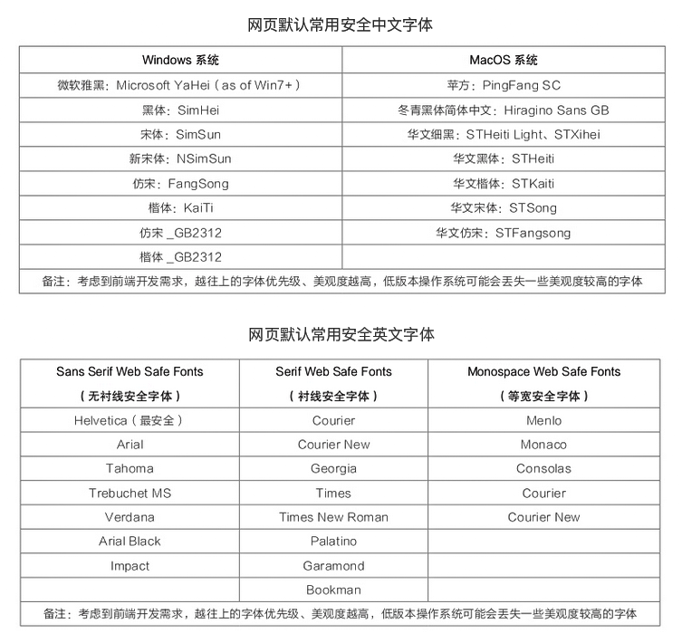

---
nav:
  title: 规范
  order: 1
group:
  title: 代码层
  order: 5
order: 3
---

# 样式规范

规范原则：制定 CSS 样式书写的全局规则，也为设计提供方向指导

## 1. 命名规范

【强制】

1. class 采用 **kebab-case**
2. id 采用 **camelCase**，但最好不要用
3. 禁止使用拼音，拼音缩写

【建议】

1. 布局类 class 使用 **l-?** 或者 **lay-?**
2. 盒子类 class 使用 **b-?** 或者 **box-?**
3. 组件类 class 使用 **c-?** 或者 **com-?**
4. 原子样式名称简写可使用 quickcss

## 2. 通用规范

【强制】

1. 符合 prettier 的编写风格，eslint 可对其校验，vetur 可对其 format
2. less，scss 的嵌套层级应控制在 **3** 层内，并尽量避免超过 **4** 层
3. 样式里长度为 0 的省略单位，比如 `padding: 0px; >> padding: 0;`
4. 小数值小于 1，别写.前面的 0，比如` padding: 0.5em; >> padding: .5em;`

【建议】

1. 尽量减少重复代码，养成样式复用思想进行样式代码编写

```
/* good */
<div class="animal cat">猫</div>
<div class="animal dog">狗</div>

.animal {
    display: flex;
    width: 100px;
    height: 100px;
    margin: 10px;

    &.cat {
      background-color: #00FF00;
      font-size: 12px;
    }
    &.dog {
      background-color: #FF00FF;
      font-size: 14px;
    }
}

/* bad */
<div class="animal-cat">猫</div>
<div class="animal-dog">狗</div>

.animal-cat{
    display: flex;
    width: 100px;
    height: 100px;
    margin: 10px;
    background-color: #00FF00;
    font-size: 12px
}
.animal-dog{
    display: flex;
    width: 100px;
    height: 100px;
    margin: 10px;
    background-color: #FF00FF;
    font-size: 14px;
}
```

2. !important 谨慎使用

## 3. 字体

字体一般包括字族，字号，字重相关。

### 3.1 字体设计

#### 3.1.1 字族



#### 3.1.2 字号

基础字号包含：

- <span style="font-size: 12px">辅助文字: 12px Extra Small</span>
- <span style="font-size: 14px">正文: 14px Base</span>
- <span style="font-size: 16px">小标题: 16px Medium</span>
- <span style="font-size: 18px">标题: 18px large</span>
- <span style="font-size: 20px">主标题: 20px Extra large</span>

#### 3.1.3 字重

基础字重包含：

- <span style="font-weight: normal">基础字重: 400 - normal</span>
- <span style="font-weight: lighter">细字重: 100 - lighter</span>
- <span style="font-weight: bold">粗字重: 700 - bold</span>
- <span style="font-weight: bolder">更粗字重: 900 - bolder</span>

### 3.2 字体规范

【强制】

【建议】

## 4. 颜色

一套完整的色彩规范，包括主色、语义色、中性色：

- 主色：系统主色，出现最多的颜色，在需要用色强调而且没有其他要求时，一般都会选择主色，基础组件也都会采用主色。
- 语义色：即功能色，借助人们的对色彩的心理模型，帮助人高效获得信息。例如绿色代表通行、成功，红色代表禁止、错误，橙色代表警告。
- 中性色：包括文字，边框，背景色等，中性色也被大量运用在分割线、边框、背景等场景中。

### 4.1 颜色设计

<html>
<style>
  .color-box {
    display:flex;
    align-items: center;
    .item {
      width:120px;
      height:60px;
      display:flex;
      justify-content:center;
      align-items: center;
      margin: 0 10px;
      font-size: 12px;
      color:#FFF;
    }
    .item.dark {
      color: #303133;
    }
    .item.border {
      border: #909399 1px solid;
    }
  }
</style>
<h4>2.1 主色：可变</h4>
<div class="color-box">
  <div class="item" style="background-color:#409EFF;">主色<br/>#409EFF</div>
</div>
<h4>2.2 功能色：已存在不可变，可增加</h4>
<div class="color-box">
  <div class="item" style="background-color:#67C23A;">成功<br/>#67C23A</div>
  <div class="item" style="background-color:#E6A23C">警告<br/>#E6A23C</div>
  <div class="item" style="background-color:#F56C6C">危险<br/>#F56C6C</div>
  <div class="item" style="background-color:#909399">信息<br/>#909399</div>
</div>
<h4>2.3 文字：不可变</h4>
<div class="color-box">
  <div class="item" style="background-color:#303133;">主要文字<br/>#303133</div>
  <div class="item" style="background-color:#606266;">常规文字<br/>#606266</div>
  <div class="item" style="background-color:#909399;">次要文字<br/>#909399</div>
  <div class="item" style="background-color:#C0C4CC;">占位文字<br/>#C0C4CC</div>
</div>
<h4>2.4 边框：不可变</h4>
<div class="color-box">
  <div class="item dark" style="background-color:#DCDFE6;">一级边框<br/>#DCDFE6</div>
  <div class="item dark" style="background-color:#E4E7ED;">二级边框<br/>#E4E7ED</div>
  <div class="item dark" style="background-color:#EBEEF5;">三级边框<br/>#EBEEF5</div>
  <div class="item dark" style="background-color:#F2F6FC">四级边框<br/>#F2F6FC</div>
</div>
<h4>2.5 背景：不可变</h4>
<div class="color-box">
  <div class="item dark" style="background-color:#F5F7FA;">基础<br/>#F5F7FA</div>
  <div class="item" style="background-color:#000000;">纯黑<br/>#000000</div>
  <div class="item dark" style="background-color:#FFFFFF;">纯白<br/>#FFFFFF</div>
  <div class="item border dark" style="background-color:transparent">透明<br/>transparent</div>
</div>
</html>

### 4.2 颜色规范

【强制】

1. 颜色色值定义禁止出现大小同时存在，必须保持全小写
2. 禁止在一个颜色色值中出现 rgb 和 16 进制混用

【建议】

1. 优先使用 16 进制表示颜色，如需添加透明度时使用 rgb

## 5. 图标

### 5.1 图标设计

优先使用组件库自带的 icon——[element-ui icon](https://element.eleme.cn/#/zh-CN/component/icon)，如有特殊 icon 需求，可在[iconfront 阿里巴巴矢量图标库](https://www.iconfont.cn/)中查找使用，未来可积累公司内部 iconfont，比如带一些建筑道路等行业的 icon。

## 6. 布局

### 6.1 布局规范

【强制】

1. 在做页面布局的处理上，优先采用 flex 布局，禁止使用 float 来布局。

## 7. 边距

### 7.1 边距设计

内边距（padding）与外边距（margin）在 0-100px 范围内，均需以 4px 自增，即设计 0,4px,8px,12px,16px,20px...等此类边距，100px 以上则以 10px 自增。

### 7.2 边距规范

【强制】

1. 非单一方向的边距，使用简写

【建议】

1. 优先采用内边距处理，减少使用外边距（margin 可能会造成边距叠加，坍缩等问题）

## 8. 阴影

规定了 5 种固定的阴影值，基本上可以满足，如有特殊阴影再特别处理。

<html>
<style>
  .shadow-box {
    display:flex;
    flex-direction: column;
    .item {
      width:280px;
      height:100px;
      display:flex;
      align-items: center;
      margin: 10px 0;
      font-size: 12px;
      color: #303133;
      padding: 0 30px
    }
  }
</style>
<div class="shadow-box">
  <div class="item" style="box-shadow: 0px 1px 3px rgba(26, 30, 34, 0.08);">阴影1<br />box-shadow: 0px 1px 3px rgba(26, 30, 34, 0.08)</div>
  <div class="item" style="box-shadow: 0px 4px 6px rgba(3, 5, 7, 0.08);">阴影2<br />box-shadow: 0px 4px 6px rgba(3, 5, 7, 0.08)</div>
  <div class="item" style="box-shadow: 0px 5px 15px rgba(3, 5, 7, 0.08);">阴影3<br />box-shadow: 0px 5px 15px rgba(3, 5, 7, 0.08)</div>
  <div class="item" style="box-shadow: 0px 10px 24px rgba(3, 5, 7, 0.08);">阴影4<br />box-shadow: 0px 10px 24px rgba(3, 5, 7, 0.08)</div>
  <div class="item" style="box-shadow: 0px 15px 30px rgba(3, 5, 7, 0.08);">阴影5<br />box-shadow: 0px 15px 30px rgba(3, 5, 7, 0.08)</div>
</div>
</html>

## 9. 组件库样式

所有基础组件样式采用 [element-ui](https://element.eleme.cn/#/zh-CN/component/installation) 组件库中的组件样式，如有自定义组件，也基于 element-ui 风格进行样式定制。
