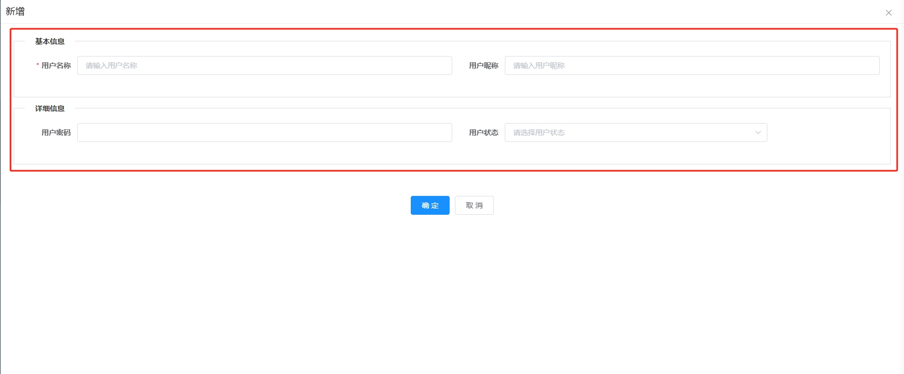

---
nav:
  title: 组件
  order: 2
group:
  title: 基础组件
  order: 1
title: VForm
order: 1
---

# VForm

基于 element ui 的 Form 定制新增/修改/查看模版组件

## 属性

### Attributes

|    参数     | 说明                                          |  类型   | 是否必须 | 默认值 |
| :---------: | :-------------------------------------------- | :-----: | :------: | :----: |
|    config     | Form 配置，对象数组，详细见下方的 config 配置项 |  Array  |   必选   |   []   |
|   columns   | 列数，仅可选 1,2,3,4,6,8,12,24 列               | Number  |   可选   |   2    |
| label-width  | label 宽度                                    | Number  |   可选   |  100   |
| action | 表单行为，'add'-新增，'edit'-修改，'view'-查看              | String |   可选   |  'add'  |
| object | 表单对象，action='edit'或'view'时传入的回显表单数据对象      | Object |   可选   |  {}  |


### Event

| 事件  | 说明     |        回调参数        |
| :---: | :------- | :--------------------: |

### Config Attributes

config是表单配置项参数，数组中的对象是表单中的Divider对象，为第一层级；Divider对象的children数组中的对象是Divider内的表单对象，为第二层级

##### Divider层级（第一层级）

|    参数     | 说明                        |      类型      |          是否必须          |
| :---------: | :-------------------------- | :------------: | :------------------------: |
|    title     | Divider名称                |     String     |             是             |
|    type     | Divider类型               |     String     |             是             |
|    name     | 插槽名称，type 为 custom 的特殊Divider场景定制时使用         |     String     |            否，但 type 为 custom 必须             |
|    children     | Divider内的表单数组                |     Array     |             否，但 type 为 form 必须       |

1. type
   Divider类型，可选值：form（默认）、custom(自定义)


##### Divider内的表单层级（第二层级）

|    参数     | 说明                        |      类型      |          是否必须          |
| :---------------- | :-------------------------- | :---------: | :--------------: |
|    type     | 表单form-item类型                |     String     |             是             |
|    label    | 表单label                |     String     |             是             |
|    name     | 插槽名称，type 为 custom 的特殊form-item场景定制时使用         |     String     |            否，但 type 为 custom 必须             |
|     key     | 键值                |     String     |             是             |
|    width    | form-item内容宽度                |     String     |             否             |
| placeholder | 占位显示文案                |     String     |             否             |
|    rule     | 规则               |     Array     |             否             |
|   disabled  | form-item内容是否禁用     |     Boolean     |             否             |
|    span     | 占据列数，小于columns列数        |     Number     |             否             |
|    data     | 数据集，type 为 select、select-tree、radio 特有      | [Array,Object] | 否，但 type 为 select、select-tree、radio 必须 | 
|   multiple<Badge>v6</Badge>   | 是否多选，type 为 select 与 select-tree特有   |     Boolean     |            否             |
|   filterable<Badge>v6</Badge>   | 是否可搜索，type 为 select 特有   |     Boolean     |            是             |
|    rows<Badge>v2</Badge>     | 文本域行数，type 为 textarea 特有         |     Number     |            否             |
|    format     | 显示格式化，type 为 日期类 特有，不包含时间类                    |     String     |             否             |
|    valueFormat     | 输出格式化，type 为 日期类 特有，不包含时间类                    |     String     |             否             |
|   prepend   | 输入框前置内容，type 为 input 特有         |     String     |            否             |
|   append   | 输入框后置内容，type 为 input 特有         |     String     |            否             |
|   ignore<Badge>v3</Badge>   | form-item内容是否忽略     |     [Boolean, Function]     |            否             |
|   limit<Badge>v4</Badge>   | 上传数量限制，type 为 fileUpload 与 imageUpload 特有   |     Number     |            否             |
|   fileSize<Badge>v4</Badge>   | 上传大小（MB）限制，type 为 fileUpload 与 imageUpload 特有   |     Number     |            否             |
|   fileType<Badge>v4</Badge>   | 上传类型限制，type 为 fileUpload 与 imageUpload 特有   |     Array     |            否             |
|   min<Badge>v5</Badge>   | 输入最小值，type 为 input-number 特有   |     Number     |            否             |
|   max<Badge>v5</Badge>   | 输入最大值，type 为 input-number 特有   |     Number     |            否             |
|   tooltip<Badge>v8</Badge>   | label的提示信息   |     String     |            否             |

注：

:::warning{title=重要}
为降低心智负担，文档库配备了可视化页面来创建Form表单配置代码，详见左侧菜单<配置可视化>
:::

1. type
   列类型，可选值：input（输入框）、input-number<Badge>v5</Badge>（数字输入框）、password（密码）、textarea<Badge>v2</Badge>（文本域）、select（下拉框）、select-tree<Badge>v9</Badge>（下拉树）、radio<Badge>v5</Badge>（单选）、radio-button<Badge>v5</Badge>（单选按钮）、checkbox<Badge>v10</Badge>（复选）、checkbox-button<Badge>v10</Badge>（复选按钮）、date（日）、week（周）、month（月）、year（年）、datetime（日期时间）、daterange（日期范围）、datetimerange（日期时间范围）、time<Badge>v7</Badge>（时间）、timerange<Badge>v7</Badge>（时间范围）、fileUpload<Badge>v4</Badge>（文件上传）、imageUpload<Badge>v4</Badge>（图片上传）、custom（自定义）

2. data
   type 为 select、select-tree、radio、radio-button、checkbox、checkbox-button 特有，示例如下：
   
```

// data类型为Array，下拉框，单选框，复选框映射关系默认为{ label: 'label' , value: 'value'}，下拉树映射关系默认为{ label: 'label' , value: 'id'}
data: this.dict.type.event_status,

// data类型为Object，手动指定映射关系
data: {
  data: customArray,
  label: 'name',
  value: 'id'
}

```   

3. span
   占据列数，用于超长的表单项，默认占据 1 列，需 <= columns，特别注意这个span并非栅格布局中的span
  
4. format与valueFormat
  type 为 data、daterange、datetimerange 特有，同elementui里DatePicker组件里的format与value-format

5. ignore
  form-item内容是否忽略，一般用于某一表单项在特定场景下显示或者忽略，类型为Boolean或Function，类型为Function时，入参为form对象，可以根据form对象其他字段参数来决定是否忽略，比如可进行如下设置

```
// 当与action关联时
{
  type: 'input',
  label: '用户密码',
  key: 'password',
  ignore: this.action !== 'add',  // 新增时显示密码表单项，修改/查看时忽略该表单项
},

// 当与其他表单项关联时
{
  type: 'input',
  label: '错误信息',
  key: 'info',
  ignore: (form) => { return form.status !== '失败' } // 当表单项状态字段不等于失败时，忽略此表单项
}
```

## 示例

### 1. 简单表单



<details>
  <summary><b style="color: #0366d6">查看代码</b></summary>
  <pre><code> 
    
    <VForm ref="form" :config="formConfig" :action="action" :object="selectObj">
      <template #nickName="slotProps">
        <el-input v-model="slotProps.form.nickName" placeholder="请输入用户昵称" maxlength="30" style="width: 100%" />
      </template>
    </VForm>

    computed: {
      formConfig() {
        return [
          {
            title: '基本信息',
            type: 'form',
            children: [
              {
                type: 'input',
                label: '用户名称',
                key: 'userName',
                placeholder: '请输入用户名称',
                rule: [
                  { required: true, message: '用户名称不能为空', trigger: 'blur' }
                ]
              },
              {
                type: 'custom',
                name: 'nickName',
                label: '用户昵称'
              }
            ]
          },
          {
            title: '详细信息',
            type: 'form',
            children: [
              {
                type: 'password',
                label: '用户密码',
                key: 'password'
              },
              {
                type: 'select',
                label: '用户状态',
                key: 'status',
                placeholder: '请选择用户状态',
                data: this.dict.type.sys_normal_disable,
                width: '70%'
              }
            ]
          }
        ]
      }
    }
  </code></pre>
</details>
