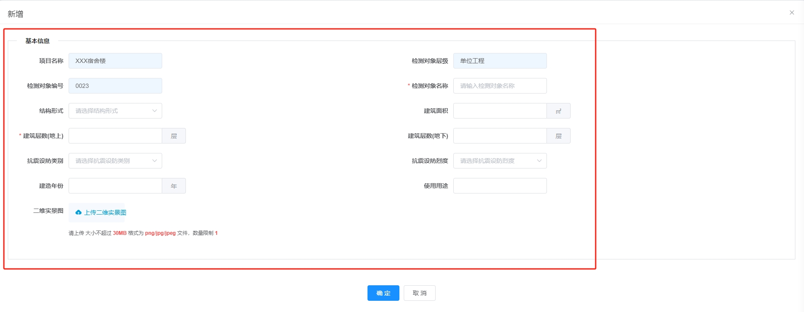

---
nav:
  title: 组件
  order: 2
group:
  title: 基础组件
  order: 1
title: VForm
order: 1
---

# VForm

基于 element ui 的 Form 定制新增/修改/查看模版组件

## 属性

### Attributes

|    参数     | 说明                                          |  类型   | 是否必须 | 默认值 |
| :---------: | :-------------------------------------------- | :-----: | :------: | :----: |
|    config     | Form 配置，对象数组，详细见下方的 config 配置项 |  Array  |   必选   |   []   |
|   columns   | 列数，仅可选 1,2,3,4,6,8,12,24 列               | Number  |   可选   |   4    |
| label-width  | label 宽度                                    | Number  |   可选   |  100   |
| action | 表单行为，'add'-新增，'edit'-修改，'view'-查看              | String |   可选   |  'add'  |
| object | 表单对象，action='edit'或'view'时传入的回显表单数据对象      | Object |   可选   |  {}  |


### Event

| 事件  | 说明     |        回调参数        |
| :---: | :------- | :--------------------: |

### Config Attributes

config是表单配置项参数，数组中的对象是表单中的Divider对象，为第一层级；Divider对象的children数组中的对象是Divider内的表单对象，为第二层级

##### Divider层级（第一层级）

|    参数     | 说明                        |      类型      |          是否必须          |
| :---------: | :-------------------------- | :------------: | :------------------------: |
|    title     | Divider名称                |     String     |             是             |
|    type     | Divider类型               |     String     |             是             |
|    name     | 插槽名称，type 为 custom 的特殊Divider场景定制时使用         |     String     |            否，但 type 为 custom 必须             |
|    children     | Divider内的表单数组                |     Array     |             否，但 type 为 form 必须       |

1. type
   Divider类型，可选值：form（默认）、custom(自定义)


##### Divider内的表单层级（第二层级）

|    参数     | 说明                        |      类型      |          是否必须          |
| :---------: | :-------------------------- | :------------: | :------------------------: |
|    type     | 表单form-item类型                |     String     |             是             |
|    label    | 表单label                |     String     |             是             |
|    name     | 插槽名称，type 为 custom 的特殊form-item场景定制时使用         |     String     |            否，但 type 为 custom 必须             |
|     key     | 键值                |     String     |             否，但 type 为非 custom 时 必须             |
|    width    | form-item内容宽度                |     String     |             否             |
| placeholder | 占位显示文案                |     String     |             否             |
|    rule     | 规则               |     Array     |             否             |
|   disabled  | form-item内容是否禁用     |     Boolean     |             否             |
|    span     | 占据列数，小于columns列数        |     Number     |             否             |
|    data     | 数据集，type 为 select 特有                       | [Array,Object] | 否，但 type 为 select 必须 | 
|    rows<sup style="color: red">v2</sup>     | 文本域行数，type 为 textarea 特有         |     Number     |            否             |
|    format     | 显示格式化，type 为 日期时间类 特有                    |     String     |             否             |
|    valueFormat     | 输出格式化，type 为 日期时间类 特有                    |     String     |             否             |
|   prepend   | 输入框前置内容，type 为 input 特有         |     String     |            否             |
|   append   | 输入框后置内容，type 为 input 特有         |     String     |            否             |
|   ignore<sup style="color: red">v3</sup>   | form-item内容是否忽略     |     Boolean     |            否             |
|   limit<sup style="color: red">v4</sup>   | 上传数量限制，type 为 fileUpload 与 imageUpload 特有   |     Number     |            否             |
|   fileSize<sup style="color: red">v4</sup>   | 上传大小（MB）限制，type 为 fileUpload 与 imageUpload 特有   |     Number     |            否             |
|   fileType<sup style="color: red">v4</sup>   | 上传类型限制，type 为 fileUpload 与 imageUpload 特有   |     Array     |            否             |

注：

1. type
   列类型，可选值：input（输入框）、password（密码）、textarea<sup style="color: red">v2</sup>（文本域）、select（下拉框）、data（日）、week（周）、month（月）、year（年）、datetime（日期时间）、daterange（日期范围）、datetimerange（日期时间范围）、fileUpload<sup style="color: red">v4</sup>（文件上传）、imageUpload<sup style="color: red">v4</sup>（图片上传）custom（自定义）

2. data
   type 为 select 特有，下拉框数据集，类型为 Array 或 Object，示例如下：

```
// data类型为Array，映射关系默认为{ label: 'label' , value: 'value'}
data: this.dict.type.event_status,

// data类型为Object，手动指定映射关系
data: {
  data: customArray,
  label: 'name',
  value: 'id'
}

```

3. span
   占据列数，用于超长的查询项，默认占据 1 列，需小于 columns
  
4. format与valueFormat
  type 为 data、daterange、datetimerange 特有，同elementui里DatePicker组件里的format与value-format

5. ignore
  form-item内容是否忽略，一般用于某一表单项在特定场景下显示或者忽略，比如在新增时显示，在修改/查看时忽略，可进行如下设置

```
{
  type: 'input',
  label: '用户密码',
  key: 'password',
  ignore: this.action !== 'add',  // 新增时显示密码表单项，修改/查看时忽略该表单项
  rule: [
    {
      required: true,
      message: '用户密码不能为空',
      trigger: 'blur'
    },
    {
      min: 5,
      max: 20,
      message: '用户密码长度必须介于 5 和 20 之间',
      trigger: 'blur'
    },
    {
      pattern: /^[^<>"'|\\]+$/,
      message: '不能包含非法字符：< > " \' \\ |',
      trigger: 'blur'
    }
  ]
},
```

## 示例

### 1. 简单表单


<details>
  <summary><b style="color: #0366d6">查看代码</b></summary>
  <pre><code> 
    
    <VForm ref="form" :config="formConfig" :action="action" :object="selectObj">
      <template #nickName="slotProps">
        <el-input v-model="slotProps.form.nickName" placeholder="请输入用户昵称" maxlength="30" style="width: 100%" />
      </template>
    </VForm>

    computed: {
      formConfig() {
        return [
          {
            title: '基本信息',
            type: 'form',
            children: [
              {
                type: 'input',
                label: '用户名称',
                key: 'userName',
                placeholder: '请输入用户名称',
                rule: [
                  { required: true, message: '用户名称不能为空', trigger: 'blur' }
                ]
              },
              {
                type: 'custom',
                name: 'nickName',
                label: '用户昵称'
              }
            ]
          },
          {
            title: '详细信息',
            type: 'form',
            children: [
              {
                type: 'password',
                label: '用户密码',
                key: 'password'
              },
              {
                type: 'select',
                label: '用户状态',
                key: 'status',
                placeholder: '请选择用户状态',
                data: this.dict.type.sys_normal_disable,
                width: '70%'
              }
            ]
          }
        ]
      }
    }
  </code></pre>
</details>

### 2. 复杂表单


<details>
  <summary><b style="color: #0366d6">查看代码</b></summary>
  <pre><code> 
    
    <VForm ref="form" :config="formConfig" :label-width="120" :action="action" :object="object" />

    computed: {
      formConfig() {
        return [
          {
            title: '基本信息',
            type: 'form',
            children: [
              {
                type: 'input',
                label: '项目名称',
                key: 'projectName',
                disabled: true,
                width: '100%'
              },
              {
                type: 'input',
                label: '检测对象层级',
                key: 'level',
                disabled: true
              },
              {
                type: 'input',
                label: '检测对象编号',
                key: 'code',
                disabled: true
              },
              {
                type: 'input',
                label: '检测对象名称',
                key: 'name',
                placeholder: '请输入检测对象名称',
                rule: [
                  {
                    required: true,
                    message: '请输入检测对象名称',
                    trigger: 'blur'
                  },
                  {
                    min: 0,
                    max: 10,
                    message: '长度需小于10个字符',
                    trigger: 'blur'
                  }
                ]
              },
              {
                type: 'select',
                label: '结构形式',
                key: 'structureForm',
                placeholder: '请选择结构形式',
                data: this.dict.type.structure_form
              },
              {
                type: 'input',
                label: '建筑面积',
                key: 'buildArea',
                append: '㎡',
                rule: [
                  {
                    pattern: /^[1-9]\d{0,6}(\.\d{1,3})?$|^0(\.\d{1,3})?$/,
                    message: '输入值需是正数，保留三位小数，且最大为1000000',
                    max: 1000000
                  }
                ]
              },
              {
                type: 'input',
                label: '建筑层数(地上)',
                key: 'buildLayerNoLand',
                append: '层',
                rule: [
                  {
                    required: true,
                    message: '请输入建筑层数(地上)',
                    trigger: 'blur'
                  },
                  {
                    pattern: /^[1-9]\d*$/,
                    message: '建筑层数(地上)需为正整数',
                    trigger: 'blur'
                  }
                ]
              },
              {
                type: 'input',
                label: '建筑层数(地下)',
                key: 'buildLayerNoUnderground',
                append: '层',
                rule: [
                  {
                    pattern: /^[1-9]\d*$/,
                    message: '建筑层数(地下)需为正整数',
                    trigger: 'blur'
                  }
                ]
              },
              {
                type: 'select',
                label: '抗震设防类别',
                key: 'antiSeismicType',
                placeholder: '请选择抗震设防类别',
                data: this.dict.type.anti_seismic_type
              },
              {
                type: 'select',
                label: '抗震设防烈度',
                key: 'antiSeismicIntensite',
                placeholder: '请选择抗震设防烈度',
                data: this.dict.type.anti_seismic_intensite
              },
              {
                type: 'input',
                label: '建造年份',
                key: 'buildYear',
                append: '年',
                rule: [
                  {
                    validator(rule, value, callback) {
                      if (value) {
                        if (
                          !/^([0-9]{3}[1-9]|[0-9]{2}[1-9][0-9]|[0-9][1-9][0-9]{2}|[1-9][0-9]{3})$/.test(
                            value
                          )
                        ) {
                          return callback(new Error('请输入4位年份'))
                        }
                        const year = moment().format('YYYY')
                        if (_.gt(value, year)) {
                          return callback(
                            new Error('输入的4位年份必须小于或等于今年')
                          )
                        }
                      }
                      callback()
                    },
                    trigger: 'blur'
                  }
                ]
              },
              {
                type: 'input',
                label: '使用用途',
                key: 'useTo'
              },
              {
                type: 'fileUpload',
                label: '二维实景图',
                key: 'liveFile'
              }
            ]
          }
        ]
      }
    }
  </code></pre>
</details>