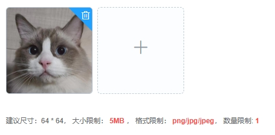

---
nav:
  title: 组件
  order: 2
group:
  title: 基础组件
  order: 1
title: VImageUpload
order: 7
---

# VImageUpload<Badge>v2.1</Badge>

基于 element ui 的 FileUpload 进行封装，适用于一般图片上传场景。

## 属性

### Attributes

|      参数       | 说明                          |  类型   | 是否必须 |                      默认值                       |
| :-------------: | :---------------------------- | :-----: | :------: | :-----------------------------------------------: |
| value / v-model | v-model 绑定值                | String  |   必选   |                        ''                         |
|       tip       | 定制提示文案，显示在限制提示文案前 | String  |   可选   |                        ''                         |
|      limit      | 上传数量限制                  | Number  |   可选   |                         5                         |
|    file-size     | 上传文件大小限制              | Number  |   可选   |                         5                         |
|    file-type     | 上传文件类型                  |  Array  |   可选   | ['png', 'jpg', 'jpeg', 'gif']                     |
|    is-show-tip    | 是否显示提示                  | Boolean |   可选   |                       true                        |
|    disabled     | 是否禁用                      | Boolean |   可选   |                       false                       |

### Event

|   事件   | 说明         |      回调参数      |
| :------: | :----------- | :----------------: |
| success  | 成功上传回调 | fileListStr 字符串 |
|  error   | 失败上传回调 |     error 对象     |
| progress | 上传进度回调 |    percent 数值    |

### Slot

| 插槽 | 说明                         |
| :--: | :--------------------------- |
| tip  | 提示栏插槽，一般为文案 |
