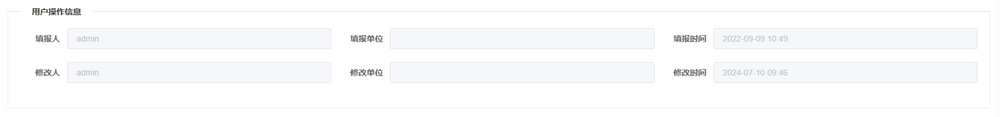

---
nav:
  title: 组件
  order: 2
group:
  title: 基础组件
  order: 1
title: VTrace
order: 5
---

# VTrace<Badge>v1.0</Badge>

通用追踪组件，显示填报信息（人，单位，时间）和修改信息（人，单位，时间），在表单的查看页面限制，不会在新增和修改表单中显示

## 属性

### Attributes

|  参数  | 说明                                                          |  类型  | 是否必须 | 默认值 |
| :----: | :------------------------------------------------------------ | :----: | :------: | :----: |
| action | 表单类型，为'add','edit','view'                               | String |   可选   | 'add'  |
|  data  | 追踪对象，action='edit'必须，包含 recorder 和 editor 相关参数 | Object |   可选   |   {}   |
| is-narrow | 是否窄屏显示                                             | Boolean |   可选   |   false   |

### Event

|      事件       | 说明                    |                    回调参数                    |
| :-------------: | :---------------------- | :--------------------------------------------: |
| loaded-recorder | recorder 加载数据后回调 | 信息对象，包含填报，修改，当前用户相关字段信息 |
|   loaded-edit   | edit 加载数据后回调     | 信息对象，包含填报，修改，当前用户相关字段信息 |
