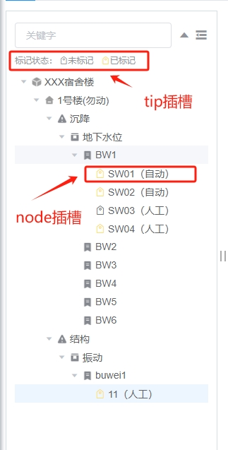

---
nav:
  title: 组件
  order: 2
group:
  title: 基础组件
  order: 1
title: VTree
order: 4
---

# VTree

基于 element ui 的 Tree 进行树组件封装，只适用于一般通用树。

## 属性

### Attributes

|     参数     | 说明                                             |  类型   | 是否必须 |                      默认值                       |
| :----------: | :----------------------------------------------- | :-----: | :------: | :-----------------------------------------------: |
|     data     | 显示的数据，与 el-tree 的 data 一致              |  Array  |   必选   |                        []                         |
| default-props | 显示数据对象的映射关系，与 el-tree 的 props 一致 | Object  |   可选   | {children: 'children',label: 'label',value: 'id'} |
|   default    | 默认值，为 data 数组中的某个对象 node            | Object  |   可选   |                        {}                         |
| is-expand-all  | 是否默认展开                                     | Boolean |   可选   |                       false                       |
| is-toolbar-show | 是否显示工具栏（查询，展开/收缩，隐藏/显示）| Boolean |   可选   |                       true                       |
| expand-on-click-node | 是否点击节点默认展开/收缩子节点              | Boolean |   可选   |                       true                       |

### Event

|  事件  | 说明               |     回调参数     |
| :----: | :----------------- | :--------------: |
| change | 点击树节点回调函数 | 点击的 node 对象 |

### Method

|  事件  | 说明               |     回调参数     |
| :----: | :----------------- | :--------------: |
| setCurrentKey | 见element-ui tree的setCurrentKey方法 | 待被选节点的 key，若为 null 则取消当前高亮的节点 |

### Slot
|     插槽      | 说明                                   |
| :-----------: | :------------------------------------- |
|  tip   | 提示插槽               |
| node | 节点插槽，作用域对象为节点对象                       |

注：

插槽位置：


```
使用方法：
<Tree ref="tree" :data="treeData.data" :default-props="treeProps" is-expand-all @change="handleNodeClick">
  <template #tip>
    <span style="font-size: 12px">
      标记状态：
      <i class="el-icon-price-tag" />未标记&nbsp;
      <i class="el-icon-price-tag ml-8" style="color: #fdde60" />已标记
    </span>
  </template>
  <template #node="scope">
    <span v-if="scope.data.treeNodeType === 'pro'">
      
    </span>
    <span>{{ scope.data.name }}</span>
  </template>
</Tree>
```