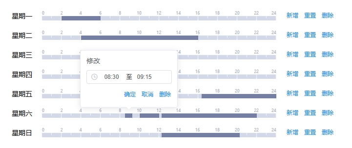

---
nav:
  title: 组件
  order: 2
group:
  title: 基础组件
  order: 1
title: VAlarmTimeMarker
order: 96
---

# VAlarmTimeMarker

告警时段选择组件，能直观显示一个标准周内的所有告警时段，支持增删改时间段，一键重置与一键删除当天时间段



## 属性

### Attributes

|     参数      | 说明           |  类型   | 是否必须 | 默认值 |
| :-----------: | :------------- | :-----: | :------: | :----: |
| v-model | 时间段对象数组，数据结构见引用代码 | Array |  是  |  []  |
| action | 表单行为，'add'-新增，'edit'-修改，'view'-查看 | String |   可选   |  'add'  |


## 源代码

### 引用代码

<details>
<summary>点击展开源代码</summary>

```vue
<template>
  <VAlarmTimeMarker v-model="timeData" :action="action" />
</template>

<script>
export default {
  data() {
    return {
      action: 'add',
      timeData: [
        {
          id: '324234234234234',
          dayOfWeek: '1',
          startTime: '02:00',
          endTime: '06:00'
        },
        {
          id: '3458768645645645',
          dayOfWeek: '2',
          startTime: '04:00',
          endTime: '16:00'
        },
        {
          id: '234357784734565',
          dayOfWeek: '7',
          startTime: '12:15',
          endTime: '20:15'
        },
        {
          id: '686794634643',
          dayOfWeek: '6',
          startTime: '08:30',
          endTime: '09:15'
        },
        {
          id: '345435657687665876',
          dayOfWeek: '5',
          startTime: '16:20',
          endTime: '23:59'
        },
        {
          id: '56756756756756756',
          dayOfWeek: '6',
          startTime: '10:00',
          endTime: '12:00'
        },
        {
          id: '345435345345345',
          dayOfWeek: '6',
          startTime: '12:15',
          endTime: '22:00'
        }
      ]
    }
  }
}
</script>
```

</details>

### 组件代码

<details>
<summary>点击展开源代码</summary>

```vue

<template>
  <div class="b-time-marker">
    <div v-for="w in weeks" :key="`time-marker-week-${w.id}`" class="f-r --c my-12">
      <div class="f-r --c h-28 fs-14">{{ t(w.name) }}</div>
      <div class="b-time-bar" />
      <div>
        <el-popover v-model="visible[w.id]" placement="top" width="200" @show="setTimeRange()">
          <div>{{ t('新增') }}</div>
          <div class="f-c my-8">
            <el-time-picker
              v-model="range"
              is-range
              :range-separator="t('至')"
              size="mini"
              value-format="HH:mm"
              format="HH:mm"
              style="width: 175px"
              popper-class="custom-time-picker"
            />
          </div>
          <div class="f-r -e --c">
            <el-button type="text" size="mini" @click="addTime(w)">{{ t('确定') }}</el-button>
            <el-button type="text" size="mini" @click="visible[w.id] = false">{{ t('取消') }}</el-button>
          </div>
          <el-button slot="reference" type="text" size="mini" :disabled="action === 'view'">{{ t('新增') }}</el-button>
        </el-popover>
        <el-button type="text" size="mini" style="margin-left:10px;" :disabled="action === 'view'" @click="resetAllTime(w)">{{ t('重置') }}</el-button>
        <el-button type="text" size="mini" :disabled="action === 'view'" @click="deleteAllTime(w)">{{ t('删除') }}</el-button>
      </div>
    </div>
    <el-popover v-for="time in value" :key="`time-marker-day-${time.id}`" v-model="visible[time.id]" placement="top" width="200" @show="setTimeRange(time)">
      <div>{{ t('修改') }}</div>
      <div class="f-c my-8">
        <el-time-picker
          v-model="range"
          is-range
          :range-separator="t('至')"
          size="mini"
          value-format="HH:mm"
          format="HH:mm"
          style="width: 175px"
          popper-class="custom-time-picker"
        />
      </div>
      <div class="f-r -e --c">
        <el-button type="text" size="mini" :disabled="action === 'view'" @click="editTime(time)">{{ t('确定') }}</el-button>
        <el-button type="text" size="mini" :disabled="action === 'view'" @click="visible[time.id] = false">{{ t('取消') }}</el-button>
        <el-button type="text" size="mini" :disabled="action === 'view'" @click="deleteTime(time)">{{ t('删除') }}</el-button>
      </div>
      <div slot="reference" class="time-marker-item" :style="setOffsetPosition(time)" />
    </el-popover>
  </div>
</template>

<script>
import dayjs from 'dayjs'
const isBetween = require('dayjs/plugin/isBetween')
const isSameOrAfter = require('dayjs/plugin/isSameOrAfter')
const isSameOrBefore = require('dayjs/plugin/isSameOrBefore')
dayjs.extend(isBetween)
dayjs.extend(isSameOrAfter)
dayjs.extend(isSameOrBefore)

export default {
  name: 'VAlarmTimeMarker',
  props: {
    value: {
      type: Array,
      default() {
        return []
      }
    },
    action: {
      type: String,
      default: 'add'
    }
  },
  data() {
    return {
      visible: {},
      weeks: [
        {
          id: '1',
          name: '星期一'
        },
        {
          id: '2',
          name: '星期二'
        },
        {
          id: '3',
          name: '星期三'
        },
        {
          id: '4',
          name: '星期四'
        },
        {
          id: '5',
          name: '星期五'
        },
        {
          id: '6',
          name: '星期六'
        },
        {
          id: '7',
          name: '星期日'
        }
      ],
      range: [],
      defaultStartTime: '00:00',
      defaultEndTime: '23:59'
    }
  },
  methods: {
    setOffsetPosition(time) {
      const { dayOfWeek, startTime, endTime } = time
      // 当天的日期字符串，用于拼接前缀
      const dayFormat = dayjs().format('YYYY-MM-DD')
      // 开始时间与当天00:00的差异偏离分钟，用于定位left
      const offsetStartMinute = dayjs(`${dayFormat} ${startTime}`).diff(
        `${dayFormat} 00:00`,
        'minute'
      )
      const left = _.round((offsetStartMinute * 480) / 1440 + 62, 0)
      // 结束时间与开始时间的差异偏离分钟，用于定位width
      const offsetEndMinute = dayjs(`${dayFormat} ${endTime}`).diff(
        `${dayFormat} ${startTime}`,
        'minute'
      )
      const width = _.ceil((offsetEndMinute * 480) / 1440, 0)
      // 根据星期来定位top
      const top = 40 * (dayOfWeek - 1) + 15
      return {
        left: `${left}px`,
        width: `${width}px`,
        top: `${top}px`
      }
    },
    setTimeRange(time) {
      this.range = time
        ? [time.startTime, time.endTime]
        : [this.defaultStartTime, this.defaultEndTime]
    },
    addTime(w) {
      if (this.checkTimeRangeValid(w.id)) {
        const temp = {
          id: _.uniqueId('time_'),
          dayOfWeek: w.id,
          startTime: this.range[0],
          endTime: this.range[1]
        }
        const newTimeArr = [...this.value, temp]
        this.$emit('input', newTimeArr)
        this.visible[w.id] = false
      }
    },
    editTime(t) {
      // 修改
      if (this.checkTimeRangeValid(t.dayOfWeek, t.id)) {
        const newTimeArr = _.map(this.value, (d) => {
          if (d.id !== t.id) return d
          return {
            ...d,
            startTime: this.range[0],
            endTime: this.range[1]
          }
        })
        this.$emit('input', newTimeArr)
        this.visible[t.id] = false
      }
    },
    deleteTime(t) {
      const newTimeArr = _.filter(this.value, (d) => {
        return d.id !== t.id
      })
      this.$emit('input', newTimeArr)
    },
    deleteAllTime(w) {
      const newTimeArr = _.filter(this.value, (d) => {
        return d.dayOfWeek !== w.id
      })
      this.$emit('input', newTimeArr)
    },
    resetAllTime(w) {
      const newTimeArr = _.filter(this.value, (d) => {
        return d.dayOfWeek !== w.id
      })
      const temp = {
        id: _.uniqueId('time_'),
        dayOfWeek: w.id,
        startTime: this.defaultStartTime,
        endTime: this.defaultEndTime
      }
      newTimeArr.push(temp)
      this.$emit('input', newTimeArr)
    },
    // 检查所填起止时间是否有效
    checkTimeRangeValid(weekId, timeId) {
      // 当天的日期字符串，用于拼接前缀
      const dayFormat = dayjs().format('YYYY-MM-DD')
      // 开始时间与结束时间的差异偏离分钟
      const offsetMinute = dayjs(`${dayFormat} ${this.range[1]}`).diff(
        `${dayFormat} ${this.range[0]}`,
        'minute'
      )
      if (offsetMinute < 1) {
        this.$message.error(this.t('告警时段区间过短，请重新选择！'))
        return false
      }
      const filterTimeArr = _.filter(this.value, (v) => {
        if (timeId) {
          // 修改时过滤
          return v.dayOfWeek === weekId && v.id !== timeId
        } else {
          // 新增时过滤
          return v.dayOfWeek === weekId
        }
      })
      let flag = true
      _.forEach(filterTimeArr, (d) => {
        if (
          // 当填写的开始日期在已存在的时间段之间，满足包容性[)
          dayjs(`${dayFormat} ${this.range[0]}`).isBetween(
            `${dayFormat} ${d.startTime}`,
            `${dayFormat} ${d.endTime}`,
            'minute',
            '[)'
          )
        ) {
          flag = false
        } else if (
          // 当填写的结束日期在已存在的时间段之间，满足包容性(]
          dayjs(`${dayFormat} ${this.range[1]}`).isBetween(
            `${dayFormat} ${d.startTime}`,
            `${dayFormat} ${d.endTime}`,
            'minute',
            '(]'
          )
        ) {
          flag = false
        } else if (
          dayjs(`${dayFormat} ${this.range[0]}`).isSameOrBefore(
            `${dayFormat} ${d.startTime}`,
            'minute'
          ) &&
          dayjs(`${dayFormat} ${this.range[1]}`).isSameOrAfter(
            `${dayFormat} ${d.endTime}`,
            'minute'
          )
        ) {
          // 当填写的开始日期在已存在的时间段的开始日期之前，且填写的结束日期在已存在的时间段的结束日期之后
          flag = false
        }
      })
      if (!flag) {
        this.$message.error(this.t('告警时段区间重叠，请重新选择！'))
        return false
      }
      return true
    }
  }
}
</script>

<style lang="scss" scoped>
.b-time-marker {
  position: relative;
}

.b-time-bar {
  width: 480px;
  height: 20px;
  background: url('./assets/timebar-bg.svg') no-repeat;
  background-size: 100% 100%;
  margin: 0 20px;
}

.time-marker-item {
  height: 9px;
  position: absolute;
  background-color: #757fa3;
  cursor: pointer;
}
</style>


```

</details>

