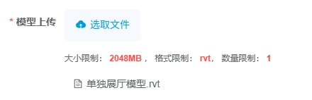

---
nav:
  title: 组件
  order: 2
group:
  title: 基础组件
  order: 1
title: VDtbimUpload
order: 8
---

# VDtbimUpload<Badge>v1.0</Badge>

基于 element ui 的 FileUpload 进行封装，只适用于Dtbim模型文件上传场景。[dtbim官方文档](https://www.dtbim.cn/)

## 属性

### Attributes

|      参数       | 说明                          |  类型   | 是否必须 |                      默认值                       |
| :-------------: | :---------------------------- | :-----: | :------: | :-----------------------------------------------: |
| value / v-model | v-model 绑定值                | String  |   必选   |                        ''                         |
|   project-id    | 项目id                      | String  |   必选   |                        ''                         |
|      token      | dtbim的token                  | String  |   必选   |                        ''                         |
|      limit      | 上传数量限制                  | Number  |   可选   |                         5                         |
|    file-size     | 上传文件大小限制              | Number  |   可选   |                         5                         |
|    file-type     | 上传文件类型                  |  Array  |   可选   | ['doc','docx','xls','xlsx','ppt','pptx','txt','pdf','png','jpg'] |
|    is-show-tip    | 是否显示提示                  | Boolean |   可选   |                       true                        |
|    disabled     | 是否禁用                      | Boolean |   可选   |                       false                       |
|      size       | 按钮大小 ，可选'small'或'big' | String  |   可选   |                      'small'                      |
|      label      | 按钮文字                      | String  |   可选   |                        ''                         |
|      tip        | 个性化提示文案，展示在限制文案前 | String  |   可选   |                       ''                         |

注：
1. tip：个性化提示文案。提示文案格式为 个性化提示文案 + 限制文案，默认个性化提示文案为空，只有限制文案（大小限制：XX，格式限制：XX，数量限制：XX）

### Event

|   事件   | 说明         |      回调参数      |
| :------: | :----------- | :----------------: |
| success  | 成功上传回调 | fileListStr 字符串 |
|  error   | 失败上传回调 |     error 对象     |
|  remove<Badge>v1.2</Badge>   | 删除列表数据回调 |  fileListStr 字符串     |

### Slot

| 插槽 | 说明                         |
| :--: | :--------------------------- |
| tip  | 提示栏插槽，一般为文案 |
