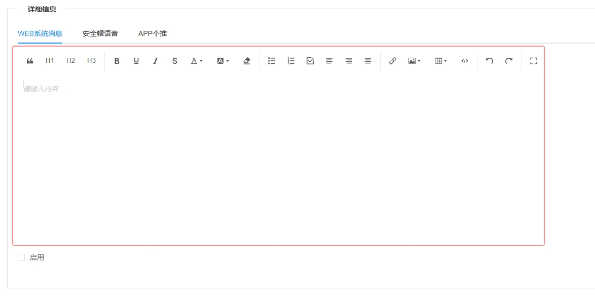

---
nav:
  title: 组件
  order: 2
group:
  title: 基础组件
  order: 1
title: VEditor
order: 9
---

# VEditor<Badge>v1.0</Badge>

基于 wangeditor 的 @wangeditor/editor-for-vue 插件库进行封装，适用于一般富文本编辑，包含基础功能，不包含视频。

## 属性

### Attributes

|      参数       | 说明                          |  类型   | 是否必须 |                      默认值                       |
| :-------------: | :---------------------------- | :-----: | :------: | :-----------------------------------------------: |
| text | 回显html文本                | String  |   可选   |                        ''                         |
| height | 高度，必须大于300px，小于此高度会产生问题  | String  |   可选   |                         '350px'                         |
| mode | 显示模式，simple：简洁模式，default：完全模式     | String  |   可选   |                         'simple'                         |

### Event

|   事件   | 说明         |      回调参数      |
| :------: | :----------- | :----------------: |
| change  | 编辑回调 |  this.$emit('change', this.html) html为编辑的文本 |

