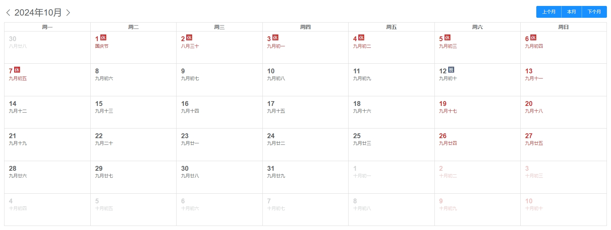
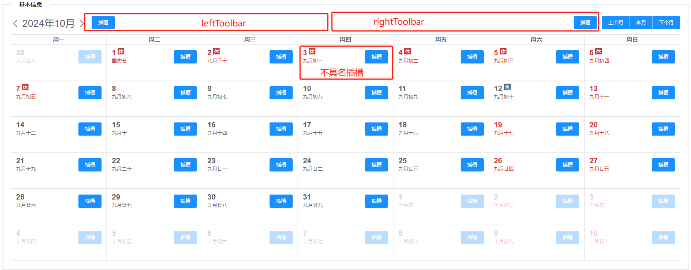

---
nav:
  title: 组件
  order: 2
group:
  title: 基础组件
  order: 1
title: VFullCalendar
order: 10
---

# VFullCalendar

基于 FullCalendar 插件库进行封装，适用于一般日历功能，包含显示农历，法定节假日，调休。



## 属性

### Attributes

|      参数       | 说明                          |  类型   | 是否必须 |                      默认值                       |
| :-------------: | :---------------------------- | :-----: | :------: | :-----------------------------------------------: |
| height | 高度  | Number  |   可选   |                         550                         |
| mode | 显示模式     | String  |   可选   |                         'simple'                         |

注：

1. mode
  mode，显示模式，可选值：简单版'simple', 标准版'standard', 复杂版'advanced'，
    a. 简单版，只显示日期数字
    b. 标准版，显示日期数字和农历
    c. 复杂版，显示日期数字，法定节假日，休假日，调休日

### slot

|     插槽      | 说明                                   |
| :-----------: | :------------------------------------- |
|  leftToolbar | 左侧工具栏插槽，slot prop传递当前月面板1号的Date对象，详见下方示例代码  |
| rightToolbar | 右侧工具栏插槽，slot prop传递当前月面板1号的Date对象，详见下方示例代码 |
|   不具名插槽   | 日历cell插槽，slot prop传递当前面板日期的Date对象，详见下方示例代码 |

注：

插槽位置：


不具名插槽应使用绝对定位样式控制，top:0,left:0 为单元格左上方

```
<VFullCalendar mode="advanced">
  <template #leftToolbar="{ date }">
    <el-button type="primary" size="small" @click="test(date)">左侧工具栏插槽</el-button>
  </template>
  <template #rightToolbar>
    <el-button type="primary" size="small">右侧工具栏插槽</el-button>
  </template>
  <template slot-scope="{ date }">
    <div style="position: absolute; top: 4px; right: 0">
      <el-button type="primary" size="small" @click="test(date)">日历cell插槽</el-button>
    </div>
  </template>
</VFullCalendar>
```

### Event

|   事件   | 说明         |      回调参数      |
| :------: | :----------- | :----------------: |
| current  | 本月按钮点击回调 |  当前月面板1号的Date对象 |
| prev  | 上一月按钮点击回调 |  当前月面板1号的Date对象 |
| next  | 下一月按钮点击回调 |  当前月面板1号的Date对象 |

