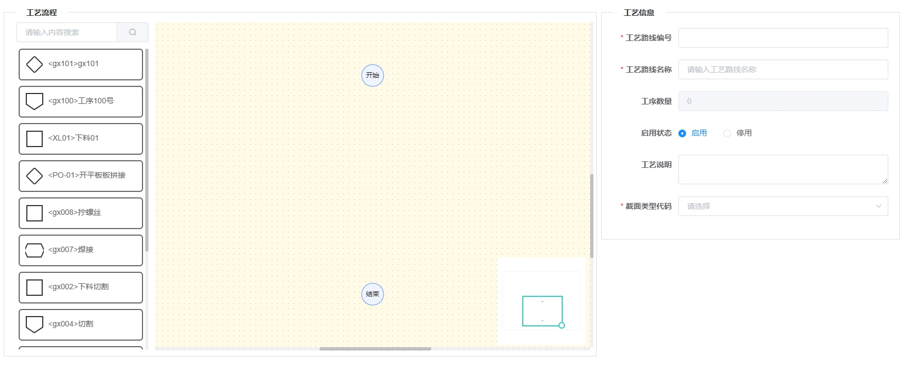

---
nav:
  title: 组件
  order: 2
group:
  title: 基础组件
  order: 1
title: VProcessFlow
order: 97
---

# VProcessFlow<Badge>v1.0</Badge>

基于 @antv/x6 二开的工艺流程编辑组件



## 属性

### Attributes

|     参数      | 说明           |  类型   | 是否必须 | 默认值 |
| :-----------: | :------------- | :-----: | :------: | :----: |
| object | 工艺信息对象 | Object |  否  |  {}  |
| action | 表单行为，'add'-新增，'edit'-修改，'view'-查看              | String |   可选   |  'add'  |
| level | 工序数据查询级别，'1' - 零件级， '2' - '部件级'，'3' - 构件级| String |  否  |  '1'  |


注：

1. 如果该组件存在dialog内、tab内或其他有切换渲染的场景时，需要加上v-if，例如：

```
<el-dialog :title="title" :visible.sync="open" :modal="false" :fullscreen="true" width="100%" :center="true">
  <VProcessFlow v-if="open" ref="form" level="2" :object="selectObj" :action="action" />
  <VTrace :data="selectObj" :action="action" />
  <div slot="footer" class="dialog-footer">
    <el-button v-if="action !== 'view'" type="primary" @click="submitForm">保 存</el-button>
    <el-button @click="open = false">取 消</el-button>
  </div>
</el-dialog>
```

