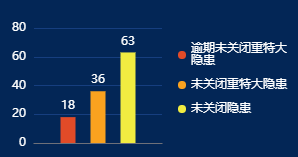

#### 示例



#### 引用代码

```javascript
<template>
  <Chart id="xxx" :data="data" :color="color" style="width: 300px;height: 250px"/>
</template>

<script>
  data() {
    return {
      data: {
        legend: ['逾期未关闭重特大隐患', '未关闭重特大隐患', '未关闭隐患'],
        xAxis: ['数量'],
        data: [[18], [36], [63]]
      }
      color:['#e14b28', '#faa21f', '#f1ec41']
    }
  }
</script>
```

#### 组件代码

```javascript
<template>
  <div :id="id" />
</template>

<script>
const CHART_ID = 'HdNotClosedChart'
/**
 * 隐患未关闭情况-柱状图
 */
export default {
  name: CHART_ID,
  props: {
    id: {
      type: String,
      default: CHART_ID
    },
    color: {
      type: Array,
      default() {
        return []
      }
    },
    data: {
      type: Object,
      default() {
        return {}
      }
    }
  },
  data() {
    return {
      chart: {}
    }
  },
  mounted() {
    this.chart = this.$echarts.init(document.getElementById(this.id))
    const option = {
      color: this.color,
      grid: {
        left: 35,
        top: 20,
        right: 140,
        bottom: 15
      },
      tooltip: {
        trigger: 'axis',
        axisPointer: {
          type: 'shadow',
          crossStyle: {
            color: '#fff'
          }
        }
      },
      legend: {
        right: 10,
        top: '20%',
        itemGap: 12,
        icon: 'circle',
        itemWidth: 8,
        itemHeight: 8,
        position: 'right',
        textStyle: {
          color: '#fff'
        },
        orient: 'vertical',
        selectedMode: false,
        data: this.data.legend,
        formatter: function (params) {
          return params.length > 8
            ? `${params.slice(0, 8)}\n${params.slice(8)}`
            : params
        }
      },
      xAxis: [
        {
          type: 'category',
          data: this.data.xAxis,
          axisLabel: {
            show: false
          },
          axisTick: {
            show: false
          }
        }
      ],
      yAxis: [
        {
          type: 'value',
          name: '',
          axisLabel: {
            color: '#fff'
          },
          splitNumber: 4,
          splitLine: {
            show: true,
            lineStyle: {
              color: '#163e7f'
            }
          }
        }
      ],
      series: []
    }
    _.forEach(this.data.data, (d, i) => {
      option.series.push({
        name: this.data.legend[i],
        type: 'bar',
        data: d,
        barGap: '1px',
        barWidth: 15,
        label: {
          show: true,
          position: 'top',
          color: '#fff'
        }
      })
    })
    this.chart.setOption(option)
    this.$nextTick(() => {
      this.chart.resize()
    })
    window.addEventListener('resize', this.resize)
  },
  beforeDestroy() {
    window.removeEventListener('resize', this.resize)
  },
  methods: {
    resize: _.debounce(function () {
      this.chart.resize()
    }, 300)
  }
}
</script>

<style lang="scss" scoped>
</style>

```
