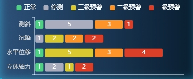

#### 示例



#### 引用代码

```vue
<template>
  <Chart :data="data" style="width: 300px;height: 250px"/>
</template>

<script>
  data() {
    return {
      data: {
        legend: ['正常', '停测', '三级预警', '二级预警', '一级预警'],
        yAxis: ['立体轴力', '水平位移', '沉降', '测斜'],
        xAxis: [
          [1, 1, 0, 1],
          [2, 0, 1, 5],
          [1, 5, 2, 0],
          [0, 3, 2, 3],
          [2, 4, 2, 1]
        ]
      }
    }
  }
</script>
```

#### 组件代码

```vue
<template>
  <div :id="id" />
</template>

<script>
const CHART_ID = 'StackChart'
export default {
  props: {
    id: {
      type: String,
      default: CHART_ID
    },
    data: {
      type: Object,
      default() {
        return {}
      }
    },
    color: {
      type: Array,
      default() {
        return ['#4FD084', '#AAADBD', '#D9C830', '#FC942A', '#DB3F27']
      }
    }
  },
  data() {
    return {
      chart: {}
    }
  },
  mounted() {
    this.chart = this.$echarts.init(document.getElementById(this.id))
    this.chart.setOption(this.getOption())
    window.addEventListener('resize', this.resize)
  },
  beforeDestroy() {
    window.removeEventListener('resize', this.resize)
  },
  methods: {
    resize: _.debounce(function () {
      this.chart.resize()
    }, 300),
    getOption() {
      const option = {
        tooltip: {
          trigger: 'axis',
          axisPointer: {
            // 坐标轴指示器，坐标轴触发有效
            type: 'shadow' // 默认为直线，可选为：'line' | 'shadow'
          }
        },
        grid: {
          top: 30,
          left: '2%',
          right: '5%',
          bottom: '3%',
          containLabel: true
        },
        dataZoom: [
          {
            type: 'inside', // 内置型数据区域缩放
            yAxisIndex: [0], // 控制哪个 x 轴被缩放
            start: 0, // 起始位置
            end: (5 / this.data.yAxis.length) * 100 // 结束位置，表示默认显示数据的范围从0%到100%
          }
        ],
        yAxis: [
          {
            type: 'category',
            data: this.data.yAxis,
            axisLine: {
              lineStyle: {
                color: 'rgba(255,255,255,0.5)', // 颜色
                width: 1 // 粗细
              }
            },
            axisLabel: {
              color: '#CECECE' // 颜色
            }
          }
        ],
        xAxis: [
          {
            type: 'value',
            splitLine: {
              show: false // 不显示网格线
            },
            axisLine: {
              show: true, // 显示坐标轴线
              lineStyle: {
                color: 'rgba(255,255,255,0.5)', // 颜色
                width: 1 // 粗细
              }
            },
            axisLabel: {
              show: false,
              color: 'rgba(255,255,255,0.5)' // 颜色
            }
          }
        ],
        legend: {
          itemWidth: 10, // 图例图形的宽度
          itemHeight: 10, // 图例图形的高度
          itemGap: 15,
          textStyle: {
            fontSize: 12, // 字体大小
            color: '#fff' // 字体颜色
          }
        },
        series: [
          {
            name: this.data.legend[0],
            type: 'bar',
            stack: 'total',
            data: this.data.xAxis[0],
            barWidth: '20',
            label: {
              show: true,
              color: '#FFF',
              formatter: function (params) {
                return params.value > 0 ? params.value : ''
              }
            },
            itemStyle: {
              // 自定义颜色
              normal: {
                color: this.color[0],
                barBorderRadius: [3, 3, 3, 3],
                borderColor: 'transparent',
                borderWidth: 3
              }
            }
          },
          {
            name: this.data.legend[1],
            type: 'bar',
            stack: 'total',
            data: this.data.xAxis[1],
            barWidth: '20',
            label: {
              show: true,
              color: '#FFF',
              formatter: function (params) {
                return params.value > 0 ? params.value : ''
              }
            },
            itemStyle: {
              // 自定义颜色
              normal: {
                color: this.color[1],
                barBorderRadius: [3, 3, 3, 3],
                borderColor: 'transparent',
                borderWidth: 3
              }
            }
          },
          {
            name: this.data.legend[2],
            type: 'bar',
            stack: 'total',
            data: this.data.xAxis[2],
            barWidth: '20',
            label: {
              show: true,
              color: '#FFF',
              formatter: function (params) {
                return params.value > 0 ? params.value : ''
              }
            },
            itemStyle: {
              // 自定义颜色
              normal: {
                color: this.color[2],
                barBorderRadius: [3, 3, 3, 3],
                borderColor: 'transparent',
                borderWidth: 3
              }
            }
          },
          {
            name: this.data.legend[3],
            type: 'bar',
            stack: 'total',
            data: this.data.xAxis[3],
            barWidth: '20',
            label: {
              show: true,
              color: '#FFF',
              formatter: function (params) {
                return params.value > 0 ? params.value : ''
              }
            },
            itemStyle: {
              // 自定义颜色
              normal: {
                color: this.color[3],
                barBorderRadius: [3, 3, 3, 3],
                borderColor: 'transparent',
                borderWidth: 3
              }
            }
          },
          {
            name: this.data.legend[4],
            type: 'bar',
            stack: 'total',
            data: this.data.xAxis[4],
            barWidth: '20',
            label: {
              show: true,
              color: '#FFF',
              formatter: function (params) {
                return params.value > 0 ? params.value : ''
              }
            },
            itemStyle: {
              // 自定义颜色
              normal: {
                color: this.color[4],
                barBorderRadius: [3, 3, 3, 3],
                borderColor: 'transparent',
                borderWidth: 3
              }
            }
          }
        ]
      }
      return option
    }
  }
}
</script>

```
