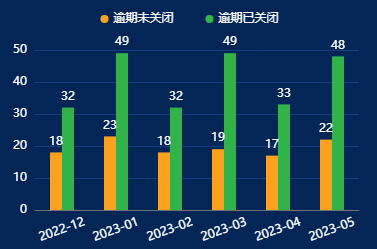
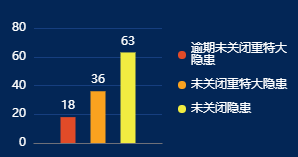
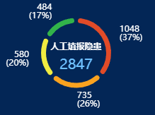
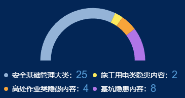

---
nav:
  title: 组件
  order: 2
order: 1
group:
  title: 图表组件
  order: 2
---

# 总览

### 柱状图

|                                                              示例                                                               |                                                              示例                                                               |
| :-----------------------------------------------------------------------------------------------------------------------------: | :-----------------------------------------------------------------------------------------------------------------------------: |
| bar-1  [查看源码](./chart-bar-1.md) | bar-2  [查看源码](./chart-bar-1.md) |

### 饼状图

|                                                              示例                                                               |                                                              示例                                                               |
| :-----------------------------------------------------------------------------------------------------------------------------: | :-----------------------------------------------------------------------------------------------------------------------------: |
| pie-1  [查看源码](./chart-pie-1.md) | pie-2  [查看源码](./chart-pie-2.md) |

|pie-3  [查看源码](./chart-pie-3.md)
