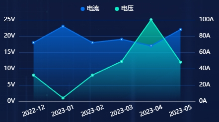

#### 示例



#### 引用代码

```javascript
<template>
  <Chart id="xxx" :data="data" :color="color" style="width: 300px;height: 250px"/>
</template>

<script>
  data() {
    return {
      data: {
        legend: ['电流', '电压'],
        xAxis: [
          '2022-12',
          '2023-01',
          '2023-02',
          '2023-03',
          '2023-04',
          '2023-05'
        ],
        data: [
          [18, 23, 18, 19, 17, 22],
          [32, 4, 32, 49, 100, 48]
        ]
      }
      color:['#0070F0', '#00F0C8']
    }
  }
</script>
```

#### 组件代码

```javascript
<template>
  <div :id="id" />
</template>

<script>
import * as echarts from 'echarts'
const CHART_ID = 'ElectricStatisticsChart'

export default {
  name: CHART_ID,
  props: {
    id: {
      type: String,
      default: CHART_ID
    },
    color: {
      type: Array,
      default() {
        return []
      }
    },
    data: {
      type: Object,
      default() {
        return {}
      }
    }
  },
  data() {
    return {
      chart: {}
    }
  },
  computed: {
    // 双Y轴辅助线调整，只针对双Y轴两条线数据情况
    computeYAxis() {
      if (this.data?.data) {
        const dataA = this.data.data[0]
        const dataB = this.data.data[1]
        const maxA = _.max(dataA)
        const maxB = _.max(dataB)
        const newMaxA = _.ceil(maxA / 5) * 5
        const newMaxB = _.ceil(maxB / 5) * 5
        const intervalA = newMaxA / 5
        const intervalB = newMaxB / 5
        return { newMaxA, newMaxB, intervalA, intervalB }
      }
      return {
        newMaxA: 0,
        newMaxB: 0,
        intervalA: 5,
        intervalB: 5
      }
    }
  },
  watch: {
    data() {
      this.chart.setOption(this.getOption())
    }
  },
  mounted() {
    this.chart = this.$echarts.init(document.getElementById(this.id))
    this.chart.setOption(this.getOption())
    window.addEventListener('resize', this.resize)
  },
  beforeDestroy() {
    window.removeEventListener('resize', this.resize)
  },
  methods: {
    resize: _.debounce(function () {
      this.chart.resize()
    }, 300),
    getOption() {
      const option = {
        color: this.color,
        grid: {
          left: 50,
          top: 45,
          right: 50,
          bottom: 40
        },
        tooltip: {
          trigger: 'axis',
          axisPointer: {
            type: 'shadow',
            crossStyle: {
              color: '#fff'
            }
          }
        },
        legend: {
          top: 12,
          itemGap: 32,
          icon: 'circle',
          itemWidth: 8,
          itemHeight: 8,
          textStyle: {
            color: '#fff'
          },
          selectedMode: false,
          data: this.data.legend
        },
        xAxis: [
          {
            type: 'category',
            data: this.data.xAxis,
            axisLabel: {
              rotate: 20,
              margin: 20,
              color: '#fff',
              align: 'center'
            },
            axisTick: {
              show: false
            }
          }
        ],
        yAxis: [
          {
            type: 'value',
            name: '',
            splitNumber: 6,
            axisLabel: {
              color: '#fff',
              formatter: function (value) {
                return value + 'V'
              }
            },
            min: 0,
            max: this.computeYAxis.newMaxA,
            interval: this.computeYAxis.intervalA,
            splitLine: {
              show: true,
              lineStyle: {
                color: '#163e7f'
              }
            }
          },
          {
            type: 'value',
            name: '',
            splitNumber: 6,
            axisLabel: {
              color: '#fff',
              formatter: function (value) {
                return value + 'A'
              }
            },
            min: 0,
            max: this.computeYAxis.newMaxB,
            interval: this.computeYAxis.intervalB,
            splitLine: {
              show: false,
              lineStyle: {
                color: '#163e7f'
              }
            }
          }
        ],
        series: []
      }
      _.forEach(this.data.data, (d, i) => {
        option.series.push({
          name: this.data.legend[i],
          yAxisIndex: i,
          type: 'line',
          data: d,
          label: {
            show: false,
            position: 'top',
            color: '#fff'
          },
          areaStyle: {
            // 该属性设置可以使这下图区域颜色达到渐变的效果
            color: new echarts.graphic.LinearGradient(0, 0, 0, 1, [
              {
                offset: 0,
                color: this.hexToRgba(this.color[i], 1)
              },
              {
                offset: 1,
                color: this.hexToRgba(this.color[i], 0)
              }
            ])
          }
        })
      })
      return option
    },

    hexToRgba(hex, opacity) {
      // 移除十六进制颜色代码中的'#'
      const sanitizedHex = hex.replace('#', '')
      // 解析红、绿、蓝值
      const r = parseInt(sanitizedHex.substring(0, 2), 16)
      const g = parseInt(sanitizedHex.substring(2, 4), 16)
      const b = parseInt(sanitizedHex.substring(4, 6), 16)
      return `rgba(${r}, ${g}, ${b}, ${opacity})`
    }
  }
}
</script>

<style lang="scss" scoped>
</style>

```
