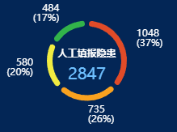

#### 示例



#### 引用代码

```javascript
<template>
  <Chart id="xxx" :data="data" :color="color" :title="title" :bg-color="bgColor" style="width: 300px;height: 250px"/>
</template>

<script>
  data() {
    return {
      title: '人工填报隐患',
      data: [
        { value: 1048, name: '特大隐患' },
        { value: 735, name: '重大隐患' },
        { value: 580, name: '较大隐患' },
        { value: 484, name: '一般隐患' }
      ]
      color:['#e14b28', '#faa21f', '#f1ec41', '#32b34a'],
      bgColor: '#032656'
    }
  }
</script>
```

#### 组件代码

```javascript
<template>
  <div :id="id" />
</template>

<script>
const CHART_ID = 'HdNumPieChart'
/**
 * 有间隔的圆角环形饼图
 */
export default {
  name: CHART_ID,
  props: {
    id: {
      type: String,
      default: CHART_ID
    },
    title: {
      type: String,
      default: ''
    },
    color: {
      type: Array,
      default() {
        return []
      }
    },
    bgColor: {
      type: String,
      default: 'transparent'
    },
    data: {
      type: Array,
      default() {
        return []
      }
    }
  },
  data() {
    return {
      chart: {}
    }
  },
  computed: {
    total() {
      return _.reduce(
        this.data,
        (sum, d) => {
          return sum + d.value
        },
        0
      )
    }
  },
  watch: {
    data() {
      this.chart.setOption(this.getOption())
    }
  },
  mounted() {
    this.chart = this.$echarts.init(document.getElementById(this.id))
    this.chart.setOption(this.getOption())
    window.addEventListener('resize', this.resize)
  },
  beforeDestroy() {
    window.removeEventListener('resize', this.resize)
  },
  methods: {
    resize: _.debounce(function () {
      this.chart.resize()
    }, 300),
    getOption() {
      const option = {
        color: this.color,
        legend: {
          show: false
        },
        title: {
          text: this.title,
          subtext: this.total,
          left: 'center',
          top: '38%',
          textStyle: {
            color: '#fff',
            fontSize: 12
          },
          subtextStyle: {
            color: '#6ec0ff',
            fontSize: 20
          }
        },
        series: [
          {
            type: 'pie',
            radius: ['50%', '65%'],
            avoidLabelOverlap: false,
            percentPrecision: 0,
            itemStyle: {
              borderRadius: 20,
              borderWidth: 5,
              borderColor: this.bgColor
            },
            label: {
              show: true,
              position: 'outside',
              formatter: '{c}\n({d}%)',
              color: '#fff',
              distanceToLabelLine: 0
            },
            labelLine: {
              show: false,
              length: 15,
              length2: 0
            },
            data: this.data
          }
        ]
      }
      return option
    }
  }
}
</script>

<style lang="scss" scoped>
</style>

```
