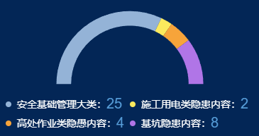

#### 示例



#### 引用代码

```javascript
<template>
  <Chart id="xxx" :data="data" :color="color" style="width: 300px;height: 250px"/>
</template>

<script>
  data() {
    return {
      data: [
        { value: 25, name: '安全基础管理大类' },
        { value: 2, name: '施工用电类隐患内容' },
        { value: 4, name: '高处作业类隐愚内容' },
        { value: 8, name: '基坑隐患内容' }
      ]
      color:['#94b3d7', '#fcea5d', '#f7a43a', '#b075e7'],
    }
  }
</script>
```

#### 组件代码

```javascript
<template>
  <div style="position: relative" class="w--100 h--100">
    <div :id="id" class="w--100 h--100" />
    <ul class="legend">
      <li v-for="(l,i) in data" :key="`${id}-chart-legend-${i}`" class="f-r --c w--50 mt-4">
        <div class="w-8 h-8 br--50" :style="`background-color: ${color[i]}`" />
        <span class="fs-14 ml-8">{{ `${data[i].name}：` }}</span>
        <span class="fs-20" style="color: #579eda">{{ `${data[i].value}` }}</span>
      </li>
    </ul>
  </div>
</template>

<script>
const CHART_ID = 'HdTypeChart'
/**
 * 隐患类别分布-半圆环饼图
 */
export default {
  name: CHART_ID,
  props: {
    id: {
      type: String,
      default: CHART_ID
    },
    color: {
      type: Array,
      default() {
        return []
      }
    },
    data: {
      type: Array,
      default() {
        return []
      }
    }
  },
  data() {
    return {
      chart: {}
    }
  },
  computed: {
    total() {
      return _.reduce(
        this.data,
        (sum, d) => {
          return sum + d.value
        },
        0
      )
    }
  },
  mounted() {
    this.chart = this.$echarts.init(document.getElementById(this.id))
    const option = {
      color: this.color,
      legend: {
        show: false
      },
      tooltip: {
        show: true,
        formatter: '{b}: {c}'
      },
      series: [
        {
          name: this.id,
          type: 'pie',
          radius: ['80%', '100%'],
          center: ['50%', '60%'],
          startAngle: 180,
          label: {
            show: false,
            color: '#fff',
            fontSize: 16,
            formatter(param) {
              return parseInt(param.percent * 2, 0) + '%'
            }
          },
          data: [
            ...this.data,
            {
              value: this.total,
              itemStyle: {
                color: 'none',
                decal: {
                  symbol: 'none'
                }
              },
              label: {
                show: false
              }
            }
          ]
        }
      ]
    }
    this.chart.setOption(option)
    window.addEventListener('resize', this.resize)
  },
  beforeDestroy() {
    window.removeEventListener('resize', this.resize)
  },
  methods: {
    resize: _.debounce(function () {
      this.chart.resize()
    }, 300)
  }
}
</script>

<style lang="scss" scoped>
.legend {
  position: absolute;
  left: 0;
  bottom: 0;
  padding: 0 12px;
  display: flex;
  justify-content: flex-start;
  flex-wrap: wrap;
  list-style-type: none;
  width: 100%;
}
</style>

```
