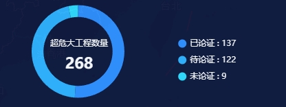

#### 示例



#### 引用代码

```javascript
<template>
  <Chart id="" :data="data" :color="color" style="width: 300px;height: 250px"/>
</template>

<script>
  data() {
    return {
      data: [
        { name: '已论证', value: 137 },
        { name: '待论证', value: 122 },
        { name: '未论证', value: 9 }
      ]
      color:['#3091FF', '#31B4FF', '#30DDFF'],
    }
  }
</script>
```

#### 组件代码

```javascript
<template>
  <div :id="id" />
</template>

<script>
const CHART_ID = 'StatisticsChartPie'

export default {
  name: CHART_ID,
  props: {
    id: {
      type: String,
      default: CHART_ID
    },
    title: {
      type: String,
      default: ''
    },
    color: {
      type: Array,
      default() {
        return []
      }
    },
    bgColor: {
      type: String,
      default: 'transparent'
    },
    data: {
      type: Array,
      default() {
        return []
      }
    }
  },
  data() {
    return {
      chart: {}
    }
  },
  computed: {
    total() {
      return _.reduce(
        this.data,
        (sum, d) => {
          return sum + d.value
        },
        0
      )
    }
  },
  watch: {
    data: {
      handler() {
        this.chart.setOption(this.getOption())
      },
      deep: true
    }
  },
  mounted() {
    this.chart = this.$echarts.init(document.getElementById(this.id))
    this.chart.setOption(this.getOption())
    window.addEventListener('resize', this.resize)
  },
  beforeDestroy() {
    window.removeEventListener('resize', this.resize)
  },
  methods: {
    resize: _.debounce(function () {
      this.chart.resize()
    }, 300),
    getOption() {
      const option = {
        color: this.color,
        title: {
          left: '40px',
          top: '40px',
          text: `{a|${this.title}}`,
          subtext: `{a|${this.total}}`,
          padding: 15,
          textStyle: {
            color: '#fff',
            width: '100',
            rich: {
              a: {
                fontSize: 12,
                lineHeight: 18,
                align: 'center'
              }
            }
          },
          subtextStyle: {
            color: '#fff',
            overflow: 'truncate',
            ellipsis: '...',
            width: '100',
            rich: {
              a: {
                fontSize: 22,
                fontWeight: 700,
                align: 'center'
              }
            }
          }
        },
        tooltip: {
          trigger: 'item'
        },
        legend: {
          orient: 'vertical',
          right: '15%',
          top: '35%',
          bottom: 10,
          icon: 'circle',
          itemWidth: 12,
          itemHeight: 12,
          itemGap: 12,
          textStyle: {
            fontSize: 12,
            color: '#fff'
          },
          formatter: (name) => {
            const item = _.find(this.data, (item) => item.name === name)
            return `${name} : ${item?.value}`
          }
        },
        series: [
          {
            type: 'pie',
            center: ['26%', '50%'],
            radius: ['67%', '90%'],
            hoverAnimation: false,
            label: {
              show: false
            },
            labelLine: {
              show: false
            },
            data: this.data
          }
        ]
      }
      return option
    }
  }
}
</script>

<style lang="scss" scoped>
</style>

```
