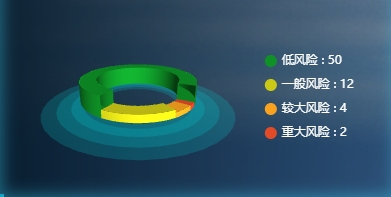

#### 示例



#### 引用代码

```javascript
<template>
  <Chart :data="data" :color="color" style="width: 300px;height: 200px"/>
</template>

<script>
  data() {
    return {
      data: [
        {
          name: '低风险',
          value: 50
        },
        {
          name: '一般风险',
          value: 12
        },
        {
          name: '较大风险',
          value: 4
        },
        {
          name: '重大风险',
          value: 2
        }
      ]
    }
  }
</script>
```

#### 组件代码

```javascript
<script>
<template>
  <div :id="id" />
</template>

<script>
import 'echarts-gl'

const CHART_ID = 'SecurityRiskPieChart'

export default {
  name: CHART_ID,
  props: {
    id: {
      type: String,
      default: CHART_ID
    },
    data: {
      type: Array,
      default() {
        return []
      }
    },
    isShowLegend: {
      type: Boolean,
      default: true
    },
    colorList: {
      type: Array,
      default: () => ['#0F9127', '#CCC916', '#FAA21F', '#E14B28']
    }
  },
  data() {
    return {
      chart: {}
    }
  },
  computed: {
    optionsData() {
      return _.map(this.data, (d, i) => {
        return {
          ...d,
          itemStyle: {
            opacity: 1,
            color: this.colorList[i]
          }
        }
      })
    }
  },
  watch: {
    data() {
      this.chart.setOption(this.getPie3D(this.optionsData, 0.71))
    }
  },
  mounted() {
    this.chart = this.$echarts.init(document.getElementById(this.id))
    this.chart.setOption(this.getPie3D(this.optionsData, 0.7))

    window.addEventListener('resize', this.resize)
  },
  beforeDestroy() {
    window.removeEventListener('resize', this.resize)
  },
  methods: {
    resize: _.debounce(function () {
      this.chart.resize()
    }, 300),
    getParametricEquation(startRatio, endRatio, isSelected, isHovered, k, h) {
      // 计算
      const midRatio = (startRatio + endRatio) / 2
      const startRadian = startRatio * Math.PI * 2
      const endRadian = endRatio * Math.PI * 2
      const midRadian = midRatio * Math.PI * 2

      // 如果只有一个扇形，则不实现选中效果。
      if (startRatio === 0 && endRatio === 1) {
        isSelected = false
      }

      // 通过扇形内径/外径的值，换算出辅助参数 k（默认值 1/3）
      k = typeof k !== 'undefined' ? k : 1 / 3

      // 计算选中效果分别在 x 轴、y 轴方向上的位移（未选中，则位移均为 0）
      const offsetX = isSelected ? Math.cos(midRadian) * 0.1 : 0
      const offsetY = isSelected ? Math.sin(midRadian) * 0.1 : 0

      // 计算高亮效果的放大比例（未高亮，则比例为 1）
      const hoverRate = isHovered ? 1.05 : 1

      // 返回曲面参数方程
      return {
        u: {
          min: -Math.PI,
          max: Math.PI * 3,
          step: Math.PI / 32
        },

        v: {
          min: 0,
          max: Math.PI * 2,
          step: Math.PI / 20
        },

        x: function (u, v) {
          if (u < startRadian) {
            return (
              offsetX +
              Math.cos(startRadian) * (1 + Math.cos(v) * k) * hoverRate
            )
          }
          if (u > endRadian) {
            return (
              offsetX + Math.cos(endRadian) * (1 + Math.cos(v) * k) * hoverRate
            )
          }
          return offsetX + Math.cos(u) * (1 + Math.cos(v) * k) * hoverRate
        },

        y: function (u, v) {
          if (u < startRadian) {
            return (
              offsetY +
              Math.sin(startRadian) * (1 + Math.cos(v) * k) * hoverRate
            )
          }
          if (u > endRadian) {
            return (
              offsetY + Math.sin(endRadian) * (1 + Math.cos(v) * k) * hoverRate
            )
          }
          return offsetY + Math.sin(u) * (1 + Math.cos(v) * k) * hoverRate
        },

        z: function (u, v) {
          if (u.max < -Math.PI * 0.5) {
            return Math.sin(u)
          }
          if (u.min > Math.PI * 2.5) {
            return Math.sin(u) * h * 0.1
          }
          return Math.sin(v) > 0 ? 1 * h * 0.1 : -1
        }
      }
    },
    getPie3D(pieData, internalDiameterRatio) {
      const series = []
      let sumValue = 0
      let startValue = 0
      let endValue = 0
      const legendData = []
      const k =
        typeof internalDiameterRatio !== 'undefined'
          ? (1 - internalDiameterRatio) / (1 + internalDiameterRatio)
          : 1 / 3

      // 为每一个饼图数据，生成一个 series-surface 配置
      for (let i = 0; i < pieData.length; i++) {
        sumValue += pieData[i].value

        const seriesItem = {
          name:
            typeof pieData[i].name === 'undefined'
              ? `series${i}`
              : pieData[i].name,
          type: 'surface',
          parametric: true,
          wireframe: {
            show: false
          },
          pieData: pieData[i],
          pieStatus: {
            selected: false,
            hovered: false,
            k: 1 / 10
          }
        }

        if (typeof pieData[i].itemStyle != 'undefined') {
          const itemStyle = {}

          typeof pieData[i].itemStyle.color != 'undefined'
            ? (itemStyle.color = pieData[i].itemStyle.color)
            : null
          typeof pieData[i].itemStyle.opacity != 'undefined'
            ? (itemStyle.opacity = pieData[i].itemStyle.opacity)
            : null

          seriesItem.itemStyle = itemStyle
        }
        series.push(seriesItem)
      }

      // 使用上一次遍历时，计算出的数据和 sumValue，调用 getParametricEquation 函数，
      // 向每个 series-surface 传入不同的参数方程 series-surface.parametricEquation，也就是实现每一个扇形。
      for (let i = 0; i < series.length; i++) {
        endValue = startValue + series[i].pieData.value
        series[i].pieData.startRatio = startValue / sumValue
        series[i].pieData.endRatio = endValue / sumValue
        series[i].parametricEquation = this.getParametricEquation(
          series[i].pieData.startRatio,
          series[i].pieData.endRatio,
          false,
          false,
          k,
          series[i].pieData.value
        )
        startValue = endValue
        legendData.push(series[i].name)
      }
      // 补充一个透明圆环，撑底
      series.push({
        type: 'surface',
        parametric: true,
        wireframe: {
          show: false
        },
        itemStyle: {
          opacity: 0.2,
          color: '#00EEF1'
        },
        parametricEquation: {
          u: {
            min: 0,
            max: Math.PI * 2,
            step: Math.PI / 20
          },
          v: {
            min: 0,
            max: Math.PI / 4,
            step: Math.PI / 20
          },
          x: function (u, v) {
            return ((Math.sin(v) * Math.sin(u) + Math.sin(u)) / Math.PI) * 2.5
          },
          y: function (u, v) {
            return ((Math.sin(v) * Math.cos(u) + Math.cos(u)) / Math.PI) * 2.5
          },
          z: function (u, v) {
            return Math.cos(v) > 0 ? -3 : -3
          }
        }
      })

      // 补充一个透明圆环，撑底
      series.push({
        type: 'surface',
        parametric: true,
        wireframe: {
          show: false
        },
        itemStyle: {
          opacity: 0.2,
          color: '#00EEF1'
        },
        parametricEquation: {
          u: {
            min: 0,
            max: Math.PI * 2,
            step: Math.PI / 20
          },
          v: {
            min: 0,
            max: Math.PI / 4,
            step: Math.PI / 20
          },
          x: function (u, v) {
            return ((Math.sin(v) * Math.sin(u) + Math.sin(u)) / Math.PI) * 3
          },
          y: function (u, v) {
            return ((Math.sin(v) * Math.cos(u) + Math.cos(u)) / Math.PI) * 3
          },
          z: function (u, v) {
            return Math.cos(v) > 0 ? -3 : -3
          }
        }
      })

      // 补充一个透明圆环，撑底
      series.push({
        type: 'surface',
        parametric: true,
        wireframe: {
          show: false
        },
        itemStyle: {
          opacity: 0.2,
          color: '#00EEF1'
        },
        parametricEquation: {
          u: {
            min: 0,
            max: Math.PI * 2,
            step: Math.PI / 20
          },
          v: {
            min: 0,
            max: Math.PI / 4,
            step: Math.PI / 20
          },
          x: function (u, v) {
            return ((Math.sin(v) * Math.sin(u) + Math.sin(u)) / Math.PI) * 3.5
          },
          y: function (u, v) {
            return ((Math.sin(v) * Math.cos(u) + Math.cos(u)) / Math.PI) * 3.5
          },
          z: function (u, v) {
            return Math.cos(v) > 0 ? -3 : -3
          }
        }
      })

      // 准备待返回的配置项，把准备好的 legendData、series 传入。
      const option = {
        legend: {
          orient: 'vertical',
          right: '10%',
          top: '25%',
          bottom: 10,
          icon: 'circle',
          itemWidth: 12,
          itemHeight: 12,
          itemGap: 12,
          textStyle: {
            fontSize: 12,
            color: '#fff'
          },
          formatter: (name) => {
            if (!_.isEmpty(name)) {
              const item = _.find(this.data, (item) => item.name === name)
              return `${name} : ${item?.value}`
            }
          }
        },
        xAxis3D: {},
        yAxis3D: {},
        zAxis3D: {},
        tooltip: {
          trigger: 'item',
          formatter: (params) => {
            return `${
              params.seriesName
            }<br/><span style="display:inline-block;margin-right:5px;border-radius:10px;width:10px;height:10px;background-color:${
              params.color
            };"></span>${option.series[params.seriesIndex].pieData.value}`
          }
        },
        grid3D: {
          viewControl: {
            autoRotate: true // 自动旋转
          },
          left: '10%',
          top: '-5%',
          width: '50%',
          show: false,
          boxHeight: 30,
          // boxWidth和boxDepth这两个属性值保持一致，才可以在调整饼图宽度的时候保持水平，不然就会歪歪扭扭
          boxWidth: 180,
          boxDepth: 180
        },
        series: series
      }
      return option
    }
  }
}
</script>


</script>
```
