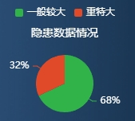

#### 示例



#### 引用代码

```vue
<template>
  <Chart :data="data" :title="title" style="width: 300px;height: 200px"/>
</template>

<script>
  data() {
    return {
      title: '隐患数据情况',
      data: [
          { value: 68, name: '一般较大', rate: '68%' },
          { value: 32, name: '重特大', rate: '32%' }
        ]
    }
  }
</script>
```

#### 组件代码

```vue
<template>
  <div :id="id" />
</template>

<script>
const CHART_ID = 'HiddenDamageDataPieChart'

export default {
  name: CHART_ID,
  props: {
    id: {
      type: String,
      default: CHART_ID
    },
    title: {
      type: String,
      default: ''
    },
    color: {
      type: Array,
      default() {
        return ['#32B34A', '#E04A29']
      }
    },
    bgColor: {
      type: String,
      default: 'transparent'
    },
    data: {
      type: Array,
      default() {
        return []
      }
    }
  },
  data() {
    return {
      chart: {}
    }
  },
  watch: {
    data() {
      this.chart.setOption(this.getOption())
    }
  },
  mounted() {
    this.chart = this.$echarts.init(document.getElementById(this.id))
    this.chart.setOption(this.getOption())
    window.addEventListener('resize', this.resize)
  },
  beforeDestroy() {
    window.removeEventListener('resize', this.resize)
  },
  methods: {
    resize: _.debounce(function () {
      this.chart.resize()
    }, 300),
    getOption() {
      const option = {
        color: this.color,
        legend: {
          show: true,
          textStyle: {
            color: '#fff',
            fontSize: 12
          },
          itemWidth: 10, // 图例图形的宽度
          itemHeight: 10 // 图例图形的高度
        },
        title: {
          text: this.title,
          left: 'center',
          top: '24px',
          textStyle: {
            color: '#fff',
            fontSize: 14,
            lineHeight: 16,
            fontWeight: 400
          }
        },
        series: [
          {
            type: 'pie',
            radius: '40%',
            center: ['50%', 100],
            itemStyle: {
              borderRadius: 0,
              borderWidth: 5,
              borderColor: this.bgColor
            },
            label: {
              show: true,
              color: '#fff',
              formatter: (params) => {
                return params.data.rate || '-'
              }
            },
            labelLine: {
              length: 5,
              length2: 5
            },
            data: this.data
          }
        ]
      }
      return option
    }
  }
}
</script>

<style lang="scss" scoped>
</style>
```
