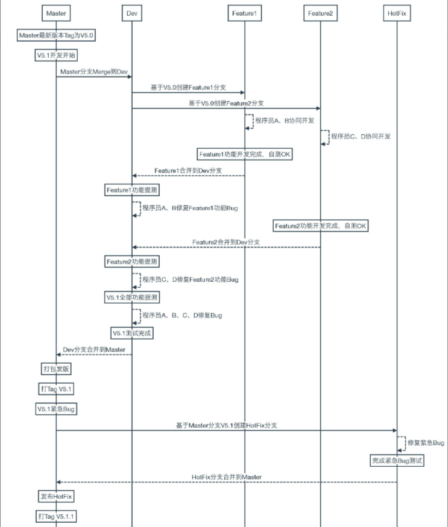

---
nav:
  title: GitFlow规范
  order: 1
group:
  title: 规范
  order: 1
---

# 流程

GitFlow 版本控制规范从整体上将代码分为四大分支结构，分别为 Master、Dev、Feature、Hotfix 分支：

1. Master: 代码的主分支，存放稳定代码的保护分支，不允许开发人员随意合并
2. Dev： 日常开发分支，这些分支不必保持绝对稳定，但是一旦达到稳定状态，它们就可以被合并入 master 分支了
3. Feature：新功能分支
4. Hotfix：bug 修复分支

基本流程规范如下图所示：

