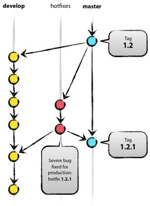

---
nav:
  title: Git流程规范
  order: 2
group:
  order: 1
---

# GitFlow 规范

## 分支规范

GitFlow 版本控制规范从整体上将代码分为两大分支结构，分别为 Master、Dev 分支：

1. Master: 代码的主分支，存放稳定代码的保护分支，不允许开发人员随意合并
2. Dev： 日常开发分支，这些分支不必保持绝对稳定，但是一旦达到稳定状态，它们就可以被合并入 master 分支了

| 分支   | 说明                                                                                           |
| ------ | ---------------------------------------------------------------------------------------------- |
| Master | 代码的主分支，存放稳定代码的保护分支，不允许开发人员随意合并                                   |
| Dev    | 日常开发分支，这些分支不必保持绝对稳定，但是一旦达到稳定状态，它们就可以被合并入 master 分支了 |

### 日常开发流程



1. 基于 Master 稳定分支先打标签 tag，如 tag：V1.2
2. 从 tag：V1.2 开始开发，在 dev 分支 merge master 分支
3. 程序员 A，B，C 开始在 dev 分支开发
4. tagV1.2 功能开发完毕并自测通过后，测试介入开始测试
5. 产生的问题依旧在 dev 分支上修复
6. 在此时间段上 master 运行分支上出现问题，checkout 一个 hotfix 分支修复，修复完成后 cherry-pick 到 dev 分支上测试，再 merge 到 master 分支上，如果需要产生版本，可打 tag：V1.2.1
7. 待 dev 分支的 tagV1.2 功能全部测试通过后，merge 到 master 分支

## commit 规范

:::warning{title=重要}
commit 规范必须严格执行！
:::

> commit 格式：`<type>: <page>-<module>-<subject>(<id>)`

```
// 例如

fix: 修复任务管理-任务调度列表操作icon竖排的bug（3290）
fix: 修改任务管理-任务作业段编辑列表header文案（3288）
```

### 1. type

类型,type 类型有且仅有下列项：

- feat: 添加新功能，新需求
- fix: 修复 bug
- docs: 仅仅修改了文档
- style: 仅仅修改了样式
- refactor: 代码重构，没有加新功能或者修复 bug
- perf: 提高用户体验，提高性能
- test: 增加测试用例
- chore: 改变构建流程、或者增加依赖库、工具等

### 2. page

页面，此次代码提交所涉及到的页面

### 3. module

模块，此次代码提交所涉及到的模块

### 4. subject

主旨，此次代码提交所涉及到的模块，简明扼要的阐述下本次提交的内容，尽量控制在 50 字以内

### 5. id

禅道 id，对应禅道的需求 id 或者 bug id，需求 id 不强制填写，但 bug id 尽量注明

## 实际项目

具体到项目层面上的 gitflow 管理规范。

### 山推

山推基于 huake 远程项目库开发

#### 主分支

1. 生产主分支: master 生产分支用于对接山推这边的代码合并，不可直接提交代码
2. 测试主分支: develop-huake 测试主分支用于发布测试环境，不可直接提交代码
3. 研发主分支: feature-ks-huake 研发主分支用于为开发环境提供稳定的基础代码，不可直接提交代码

<注意:所有主分支均不可直接提交代码，以免引起主分支合并冲突和代码的不一致>

#### 研发分支

1. 研发 2.0 版本分支: feature-ks-v2.0 用于 20 版本需求的开发选代，可提交代码
2. 研发 1.0 版本分支: feature-ks-v1.0 用于 1.0 版本的代码备份

#### 合并规则

所有的研发分支应基于研发主分支 feature-ks-huake 创建:所有的研发分支开发稳定后应合并到研发主分支上，然后再合并到测试主分支 develop-huake，最终合并到生产主分支 master;测试环境所以 bug 的修复应该在研发相关子分支上进行调整和自测，然后再合并到测试主分支 develop-huake 验证。
