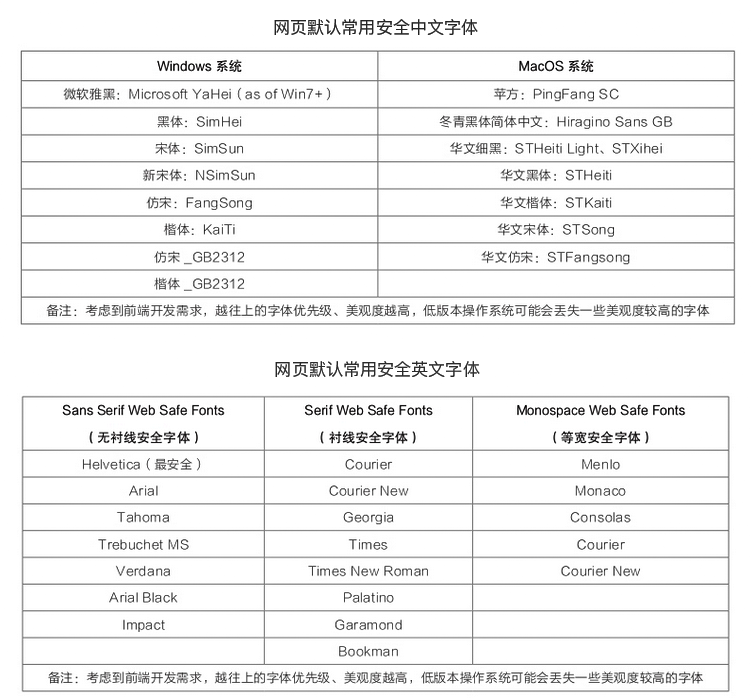
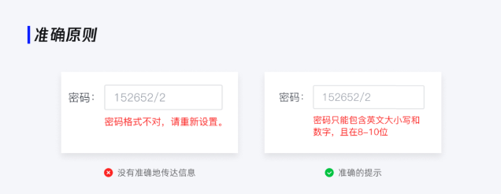
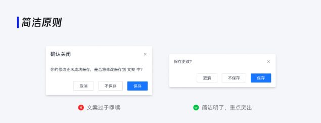
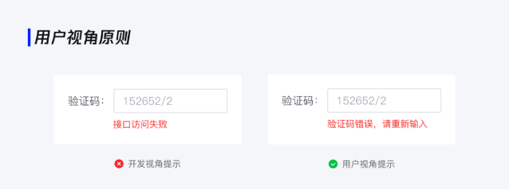

# UI 设计规范

设计原则：制定系统界面设计的全局规则，为设计提供方向指导

## 1. 字体

#### 1.1 字族

#### 1.2 字号

基础字号包含：

- 辅助文字: 12px Extra Small
- 正文: 14px Base
- 小标题: 16px Medium
- 标题: 18px large
- 主标题: 20px Extra large

#### 1.3 字重

基础字重包含：

- 基础字重: 400 - normal
- 细字重: 100 - lighter
- 粗字重: 700 - bold
- 更粗字重: 900 - bolder

## 2. 颜色

一套完整的色彩规范，包括主色、语义色、中性色：

- 主色：系统主色，出现最多的颜色，在需要用色强调而且没有其他要求时，一般都会选择主色，基础组件也都会采用主色。
- 功能色：即功能色，借助人们的对色彩的心理模型，帮助人高效获得信息。例如绿色代表通行、成功，红色代表禁止、错误，橙色代表警告。
- 中性色：包括文字，边框，背景色等，中性色也被大量运用在分割线、边框、背景等场景中。

<html>

<h4>2.1 主色：可变</h4>

  
主色 #409EFF

<h4>2.2 功能色：已存在不可变，可增加</h4>

  
成功 #67C23A

  
警告 #E6A23C

  
危险 #F56C6C

  
信息 #909399

<h4>2.3 文字：不可变</h4>

  
主要文字 #303133

  
常规文字 #606266

  
次要文字 #909399

  
占位文字 #C0C4CC

<h4>2.4 边框：不可变</h4>

  
一级边框 #DCDFE6

  
二级边框 #E4E7ED

  
三级边框 #EBEEF5

  
四级边框 #F2F6FC

<h4>2.5 背景：不可变</h4>

  
基础 #F5F7FA

  
纯黑 #000000

  
纯白 #FFFFFF

  
透明 transparent

</html>

## 3. 图标

使用图标，降低了用户的认知负荷，帮助用户更快导航，提高用户使用产品的效率。设计精致风格统一的图标提高界面的美观度的同时，也为用户带来了连贯一致的使用体验。

优先使用组件库自带的 icon——[element-ui icon](https://element.eleme.cn/#/zh-CN/component/icon)，如有特殊 icon 需求，可在[iconfront 阿里巴巴矢量图标库](https://www.iconfont.cn/)中查找使用，未来可积累公司内部 iconfont，比如带一些建筑道路等行业的 icon

## 4. 边距

内边距（padding）与外边距（margin）在 0-100px 范围内，均需以 4px 自增，即设计 0,4px,8px,12px,16px,20px...等此类边距，100px 以上则以 10px 自增。

## 5. 文案

文案是系统与用户交流的最基础最简单的沟通工具，文案存在于系统的各个地方，构建文案规范，可以规范文案的使用和编写，提高文案的质量，给用户带来连贯一致的使用体验。文案通用的一些原则，包括，准确，简洁、用户视角。

- 准确
  

- 简洁
  

- 用户视角
  

## 6. 阴影

规定了 5 种固定的阴影值，基本上可以满足，如有特殊阴影再特别处理。

<html>

  
阴影1 box-shadow: 0px 1px 3px rgba(26, 30, 34, 0.08)

  
阴影2 box-shadow: 0px 4px 6px rgba(3, 5, 7, 0.08)

  
阴影3 box-shadow: 0px 5px 15px rgba(3, 5, 7, 0.08)

  
阴影4 box-shadow: 0px 10px 24px rgba(3, 5, 7, 0.08)

  
阴影5 box-shadow: 0px 15px 30px rgba(3, 5, 7, 0.08)

</html>

## 7. 组件库

所有基础组件采用 [element-ui](https://element.eleme.cn/#/zh-CN/component/installation) 组件库中的组件，如有自定义组件，也基于 element-ui 风格进行定制。
