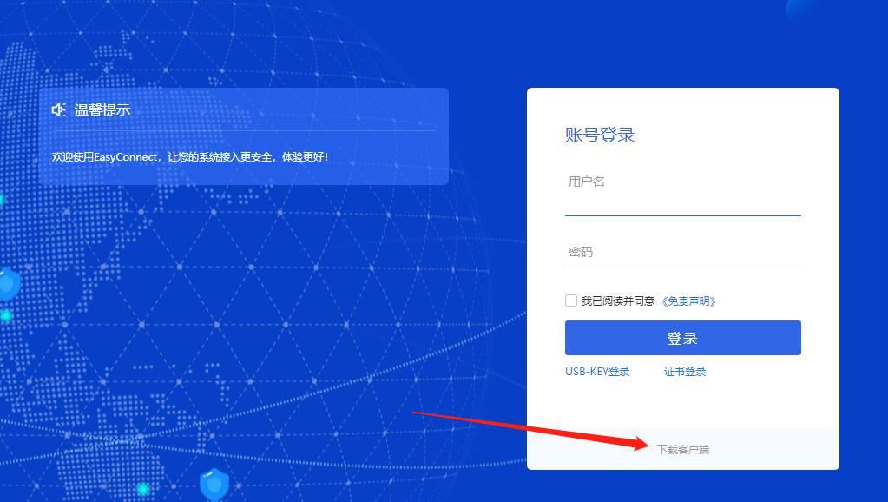
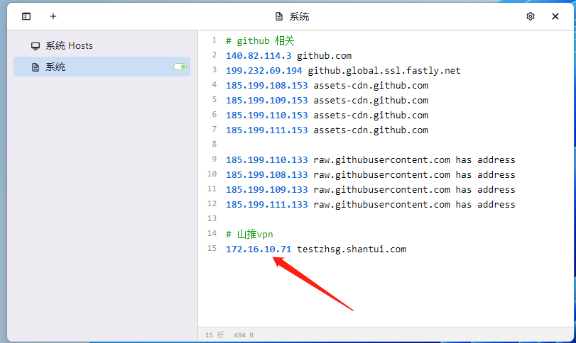

---
nav:
  title: 工程文档
  order: 3
group:
  title: 山推
  order: 1
order: 2
---

# 山推项目

## 代码库搭建

1. 下载山推 vpn

下载地址：https://itsm.huaxincem.com ，访问页面下载 vpn 客户端

2. 打开 vpn，配置信息地址：https://60.211.240.221 ，输入 vpn 用户名密码登录

3. 配置 host：172.16.10.71 testzhsg.shantui.com

4. 克隆山推项目至本地，git 项目地址：https://testzhsg.shantui.com/bitbucket/projects/Q/repos/huake/browse ，账号/密码：wanglina/Shantui@1234

5. 分支切换到 feature-ks-vX.X，进行开发

:::info{title=注意}
后续山推项目的开发，拉取/提交都必须连接 vpn
:::

## 常见配置

1. vpn 地址：https://itsm.huaxincem.com/
2. host：172.16.10.71 testzhsg.shantui.com
3. 代码库：https://testzhsg.shantui.com/bitbucket/projects/Q/repos/huake/browse
4. 测试服务器：http://192.168.1.248:9117
5. 测试服务账号：shantui/Shantui123，csqyzh1/csqyzh123
